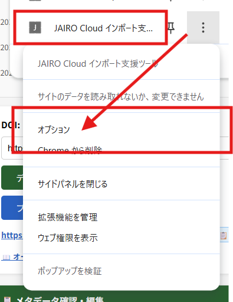

# JAIRO Cloud インポート支援ツール

[](https://chromewebstore.google.com/detail/jairo-cloud-%E3%82%A4%E3%83%B3%E3%83%9D%E3%83%BC%E3%83%88%E6%94%AF%E6%8F%B4%E3%83%84%E3%83%BC%E3%83%AB/jknijceijdmdglahkopllhlgnikapmfn)
[](https://chromewebstore.google.com/detail/jairo-cloud-%E3%82%A4%E3%83%B3%E3%83%9D%E3%83%BC%E3%83%88%E6%94%AF%E6%8F%B4%E3%83%84%E3%83%BC%E3%83%AB/jknijceijdmdglahkopllhlgnikapmfn)
[](https://chromewebstore.google.com/detail/jairo-cloud-%E3%82%A4%E3%83%B3%E3%83%9D%E3%83%BC%E3%83%88%E6%94%AF%E6%8F%B4%E3%83%84%E3%83%BC%E3%83%AB/jknijceijdmdglahkopllhlgnikapmfn)

## 概要

DOIを入力してCrossref・OpenAlex APIから書誌情報を取得し、[JAIRO Cloud](https://jpcoar.org/support/jairo-cloud/)へのインポート用TSVファイルを生成するツールです。

特に、以下の課題の解決を目指しています。

1. 識別子（ORCID、ROR、KAKENなど）の検索時間の短縮
2. メタデータ入力のサンプルの提示
3. オープンアクセスポリシーの容易な参照
4. [JAIRO Cloud](https://jpcoar.org/support/jairo-cloud/)用インポートファイル（import.zip）作成の支援

通常ブラウザ版とChrome拡張機能版の2つの利用方法があります。

- 通常ブラウザ版では、以下の機能が利用できます。
  - Crossref DOIからのメタデータ取り込みと以下のAPIによるデータ補完
    - [Research Organization Registry (ROR)](https://ror.org/)(ISNI)
    - [OpenAlex](https://openalex.org/)(ORCID)
    - [CiNii Research](https://cir.nii.ac.jp/)(NCID、科研費課題名)
  - [OpenAlex](https://openalex.org/) によるOA状況の表示
  - [JPCOARスキーマ](https://schema.irdb.nii.ac.jp/ja/schema)2.0対応のメタデータ入力
  - 入力メタデータのプレビュー表示
  - [Open Policy Finder](https://openpolicyfinder.jisc.ac.uk/)へのリンク表示
  - インポート用TSVファイル生成

- Chrome拡張機能版では、通常ブラウザ版に加えて以下の機能が利用できます。APIキーが必要ですが、こちらが高機能です。
  - 以下の3ツールのタブ切替
    - JAIRO Cloud インポート用TSV生成ツール
    - 助成情報検索ツール
    - 機関リポジトリのメタデータ検索（OpenSearch）
  - JaLC DOIからのメタデータ取り込み
  - KAKEN APIによる科研費課題番号の検索と取り込み
  - Open Policy Finderから取得したOAポリシーの表示とエンバーゴの設定

### 機能比較

| 機能 | Chrome拡張機能版 | 通常ブラウザ版 | 備考 |
|------|:---:|:---:|------|
| **導入** | | | |
| インストール不要（HTMLファイルを開くだけ） | ❌ | ✅ | |
| ブラウザの拡張機能から導入 | ✅ | ❌ | サイドパネルAPI対応のためChrome 114以降が必要 |
| **OAポリシー参照** | | | |
| OpenAlex によるOA状況の表示 | ✅ | ✅ | Crossref DOIがある論文で表示 |
| Open Policy Finder への参照リンク生成 | ✅ | ✅ | ISSN付き雑誌論文で表示 |
| Open Policy Finder API によるOAポリシー表示 | ✅ | ❌ | CORS制約のためChrome拡張機能版のみ |
| Open Policy Finder API の情報によるエンバーゴ有無と期間の設定 | ✅ | ❌ | CORS制約のためChrome拡張機能版のみ |
| **メタデータ取得** | | | |
| Crossref DOI からのメタデータ取得 | ✅ | ✅ | |
| JaLC DOI からのメタデータ取得 | ✅ | ❌ | CORS制約のためChrome拡張機能のService Worker経由が必要 |
| DataCite DOI からのメタデータ取得 | ❌ | ❌ | 未対応です |
| **メタデータ編集・出力** | | | |
| メタデータ確認・編集UI | ✅ | ✅ | JPCOARスキーマ2.0準拠 |
| ファイル名、サイズの自動入力 | ✅ | ✅ | |
| プレビュー表示 | ✅ | ✅ | |
| TSV エクスポート | ✅ | ✅ | |
| **著者・所属情報補完** | | | |
| OpenAlex によるORCID補完 | ✅ | ✅ | |
| **収録物識別子補完** | | | |
| NCID 自動取得 | ✅ | ✅ | ISSNからCiNii Researchを検索 |
| **助成情報補完** | | | |
| JGN（科学技術振興機構）課題番号検索 | ✅ | ✅ |  |
| CiNii Research API による科研費課題名取得 | ✅ | ✅ |  |
| KAKEN XML API による科研費課題検索 | ✅ | ❌ | CORS制約のためChrome拡張機能版のみ |
| **設定・運用** | | | |
| 更新チェック | ✅ | ✅ | 更新がある場合はその旨表示されます |
| APIキー設定（GUI） | ✅ | ❌ | Chrome拡張機能版は設定ページで管理 |
| APIキー設定（ソースコード編集） | ❌ | ✅ | `shared.js` のCONFIG定数を編集 |
| APIキーの永続保存 | ✅ | ❌ | Chrome拡張機能版は `chrome.storage.local` に保存 |
| **関連ツール** | | | |
| 助成情報検索ツール | ✅ | ✅ | Chrome拡張機能版はタブ切替、ブラウザ版は別HTMLファイル |
| JAIRO Cloud リポジトリ検索ツール | ✅ | ❌ | Chrome拡張機能版のみ（OpenSearchで検索） |


## 最新の更新

| ツール | 日付 | バージョン | 更新概要 |
|--------|------|-----------|----------|
| Chrome拡張機能版 | 2026-05-14 | ver. 1.9.3 | Chromeウェブストア公開名と一致するようツール名・タイトルを「JAIRO Cloud インポート支援ツール」に統一、ストア再配布用にmanifest版数を更新 |
| インポート用TSV生成ツール | 2026-03-29 | — | shared.js未配置時のフォールバック：警告表示+APIキーなしで動作継続（[#111](https://github.com/tzhaya/jc-import-file-maker/issues/111)） |
| 助成情報検索ツール | 2026-03-29 | — | shared.js未配置時のフォールバック：警告表示+APIキーなしで動作継続（[#111](https://github.com/tzhaya/jc-import-file-maker/issues/111)） |

## 導入方法

### Chrome拡張機能版（推奨）

**[👉 Chromeウェブストアからインストール](https://chromewebstore.google.com/detail/jairo-cloud-%E3%82%A4%E3%83%B3%E3%83%9D%E3%83%BC%E3%83%88%E6%94%AF%E6%8F%B4%E3%83%84%E3%83%BC%E3%83%AB/jknijceijdmdglahkopllhlgnikapmfn)**

1. 上記リンクからChromeウェブストアを開きます
2. 「**Chromeに追加**」をクリックしてインストールします
3. ツールバーの拡張機能アイコンをクリックすると、サイドパネルで起動します
4. 拡張機能の設定ページ（`chrome://extensions` → 詳細 → 拡張機能のオプション）で必要に応じてAPIキーを設定してください

**動作要件**: Chrome 114以降（サイドパネルAPI対応）

<details>
<summary>開発版（リポジトリから直接読み込み）</summary>

最新の開発版を試したい場合や、ローカルで改造したい場合は以下の手順で読み込めます。

1. このリポジトリをダウンロードします
   - `git clone https://github.com/tzhaya/jc-import-file-maker.git`、または
   - [ZIPダウンロード](https://github.com/tzhaya/jc-import-file-maker/archive/refs/heads/master.zip) して展開
2. Chromeで `chrome://extensions` を開きます
3. 右上の「**デベロッパーモード**」を有効にします
4. 「**パッケージ化されていない拡張機能を読み込む**」をクリックし、`chrome-extension` フォルダを選択します

</details>

### 通常ブラウザ版

HTMLファイルを直接ブラウザで開いて使用します。

1. [make_jc_importer.html](https://github.com/tzhaya/jc-import-file-maker/raw/refs/heads/master/make_jc_importer.html) ←右クリック→「名前をつけてリンク(先)を保存」で保存
2. [shared.js](https://github.com/tzhaya/jc-import-file-maker/raw/refs/heads/master/shared.js)←右クリック→「名前をつけてリンク(先)を保存」で保存
3. [tsv_headers_template.js](https://github.com/tzhaya/jc-import-file-maker/raw/refs/heads/master/tsv_headers_template.js)←右クリック→「名前をつけてリンク(先)を保存」で保存
4. 「メモ帳」などで shared.js を開き、APIキーを入力して保存します。 
5. make_jc_importer.htmlをブラウザで開きます

## 使い方

**このツールはベータ版です。**
**アイテムタイプ「デフォルトアイテムタイプ（フル）」の形式でのインポート用TSVファイルのみ生成できます。なお、インポートは未検証です。正しく取り込まれないことがあります。**

現在のバージョン（Phase 1）では、APIからのデータ取得・マッピング・編集UIが実装されています。

1. DOIを「DOI」の入力欄に入力します。
2. 「データ取得」ボタンを押します
3. Crossrefなどから必要なメタデータを取得して、「メタデータ確認・編集」として表示します。編集も可能です。
4. 「プレビュー表示」ボタンでプレビューができます。
5. （Chrome拡張機能版のみ）外国雑誌等でOpen Policy Finderに登録されている雑誌にはDOIの隣に「OAポリシー」のボタンが表示されます。クリックすると、Open Policy Finderから取得したオープンアクセスにできる版や掲載場所の情報を表示します。
6. TSVファイルとしてダウンロードができます（β版提供中：未検証です）

詳しい使い方と取得したデータの取り扱いは[使い方ガイド](docs/user_guide.md)を参照ください。

### 助成情報検索ツール

- 付属ツールとして、助成情報検索ツールを同梱しています。
- 科研費課題番号やJGN課題番号から、助成機関識別子・助成機関名・プログラム情報・研究課題名を検索します。
- Chrome拡張機能版ではサイドパネルのタブから「助成情報検索」に切り替えて利用できます。
- 通常ブラウザ版では [funder_lookup.html](https://github.com/tzhaya/jc-import-file-maker/raw/refs/heads/master/funder_lookup.html) を右クリック→「名前をつけてリンク(先)を保存」で保存してご利用ください。

#### 利用方法

1. 科研費課題番号やJGN課題番号、論文の謝辞（Acknowledgement）をコピー＆ペーストして「検索」を押します。
2. JPCOAR 2.0 準拠の助成情報（助成機関識別子・助成機関名・プログラム情報・研究課題名）を検索できます。
     - ヒットしない場合は、以下の参照用リンクを表示します。
       - [体系的番号](https://www.nistep.go.jp/taikei/)（NISTEP）
       - [AMED finder](https://amedfind.amed.go.jp/amed/)（日本医療研究開発機構）
       - [厚生労働科学研究成果データベース](https://mhlw-grants.niph.go.jp/)（国立保健医療科学院）
     - Chrome機能拡張のみ：[KAKEN](https://kaken.nii.ac.jp/ja/)で「補助金の研究課題番号」から「研究課題/領域番号」を検索します
3. 検索結果の助成情報を、インポート用のTSV形式で貼り付けできる形式に変換します。
4. お使いのインポート用TSVファイルのヘッダ部分（先頭5行）またはファイル全体を貼り付けると、その形式に準じて出力します。
      - 出力形式は JPCOARスキーマ 1.0/2.0 を選択できます。2.0では「プログラム情報」を出力します。
5. 開始インデックスの初期値を指定できます。すでに助成情報があり、2番目以降を入力したい場合は '1' 以降の数字に変更します。
6. 「TSV生成」ボタンを押すとTSV形式で表示されます。
7. 「クリップボードにコピー」を押すとクリップボードに結果がコピーされます。Excel、TSVファイルなどに貼り付けてご利用ください。

### OpenSearch検索ツール（Chrome拡張機能版のみ）

- Chrome拡張機能版のサイドパネルのタブから「OpenSearch検索」に切り替えて利用できます。
- JAIRO Cloud利用機関のリポジトリURL・タイトル・内容記述・資源タイプを条件に文献を検索できます。
- 検索結果はタイトル・著者・書誌情報・ファイルリンクとともに一覧表示され、クリックで詳細フィールドを展開できます。
- 設定ページでデフォルトのリポジトリURLを登録しておくと、タブを開いた際に自動入力されます。

### API Key の設定

#### Chrome拡張機能版（推奨）

Chrome拡張機能版では設定ページでAPIキーをまとめて設定できます。設定値はブラウザのローカルストレージに保存され、ソースコードに書き込む必要がありません。

1. 拡張機能の「JAIRO Cloud インポート支援ツール」の ︙ → オプション を開きます。

   

2. APIキーを入力して「保存」を押してください。

CORS非対応のAPI（KAKEN XML API・JaLC API・Open Policy Finder API）が Chrome拡張機能のService Worker経由で利用可能になります。

#### 通常ブラウザ版

`shared.js` をテキストエディタで開き、`CONFIG` 定数にAPIキーを設定してください。この設定は `make_jc_importer.html` と `funder_lookup.html` の両方に反映されます。

```js
const CONFIG = {
    // OpenAlex APIキー（任意）
    // https://openalex.org/settings/api からご自身のキーを取得して貼り付けてください
    OpenAlex_API_KEY: "YOUR_OpenAlex_API_KEY",

    // CiNii APIキー（任意）
    // CiNiiウェブAPI 利用登録 https://support.nii.ac.jp/ja/cinii/api/developer で取得したキーを貼り付けてください
    CiNii_API_KEY: "YOUR_CiNii_API_KEY",

    // Open Policy Finder APIキー（任意・Chrome拡張機能版のみ有効）
    OPF_API_KEY: "YOUR_OPF_API_KEY",
};
```

#### OpenAlex API Key（必須）

OpenAlex APIは、APIキーなしでの利用回数に制限があります。継続的に利用する場合は、APIキーの設定を推奨します。

- [OpenAlex API設定ページ](https://openalex.org/settings/api) からAPIキーを取得してください。
- 未設定の場合、ページ上部に警告メッセージが表示されます。未設定でも利用可能ですが、利用回数の制限を超えるとデータ取得時にエラーが表示されます。

#### CiNii API Key（KAKEN API利用時は必須）

- KAKEN APIは利用にあたり CiNii API Key が必要です。
- [CiNiiウェブAPI 利用登録](https://support.nii.ac.jp/ja/cinii/api/developer) からAPIキーを取得してください。

CiNii APIキー未設定でも、以下の機能が動作します：

- JSPS（日本学術振興会）が助成機関に含まれる場合に、CiNii Research Projects API を通じて科研費の課題名（日英）とKAKEN課題ページURLを自動取得
- ISSNをもとにCiNii Research OpenSearch APIからNCID（NACSIS-CAT書誌ID）を自動取得

## ディレクトリ構成

```
├── make_jc_importer.html      # メインツール（通常ブラウザ版・単一HTMLファイル）
├── funder_lookup.html         # 助成情報検索ツール（通常ブラウザ版）
├── chrome-extension/          # Chrome拡張機能版（このフォルダを読み込んで使用）
│   ├── manifest.json          #   Manifest V3 定義
│   ├── background.js          #   Service Worker（CORS プロキシ）
│   ├── panel.html             #   サイドパネル（メインツール）
│   ├── make_jc_importer.js    #   メインツール ロジック
│   ├── funder_panel.html      #   サイドパネル（助成情報検索）
│   ├── funder_lookup.js       #   助成情報検索 ロジック
│   ├── options.html           #   設定ページ（APIキー管理 UI）
│   └── options.js             #   設定ページ ロジック
├── api-flow.md                # APIフロー整理（Crossref/OpenAlex等の取得順・JPCOARマッピング）
├── data/                      # 参照・設定データ
│   ├── ItemType.json          # JAIRO Cloud アイテムタイプ定義
│   ├── tsv_headers.json       # TSVヘッダー定義
│   └── crossref_fields.json   # Crossrefフィールド定義
├── docs/                      # 仕様・設計ドキュメント
│   ├── requirements.md         # 要件定義
│   ├── user_guide.md           # 使い方ガイド
│   ├── worklog.md              # 作業ログ
│   └── ...                     # 実装計画・フィールドリファレンス等
└── samples/                   # サンプルデータ（API レスポンス等）
```

## ドキュメント

- [要件定義](docs/requirements.md)
- [使い方ガイド](docs/user_guide.md)
- [作業ログ](docs/worklog.md) 実装作業時のログです。
- [APIフロー整理](api-flow.md) Crossref/OpenAlex等の取得順・JPCOARマッピングの概要です。
- [機能と技術](function.md) 機能と技術、実装に関するドキュメントです。

## ライセンス

このプロジェクトは [CC0 1.0 Universal (CC0 1.0) Public Domain Dedication](https://creativecommons.org/publicdomain/zero/1.0/) の下で公開されています。詳細は [LICENSE](LICENSE) ファイルを参照してください。

外部APIから得られたデータの利用については、それぞれの利用規約に従ってください。

  -  [Crossref](https://api.crossref.org/)
  -  [JaLC](https://api.japanlinkcenter.org/api-docs/index.html)
  -  [OpenAlex](https://api.openalex.org/)
  -  [ROR](https://ror.org/about/terms/),
  -  [CiNii Research、KAKEN API](https://support.nii.ac.jp/ja/cinii/terms)

## プライバシーポリシー

- [プライバシーポリシー](docs/privacy-policy.md)をご参照ください。

## AIの利用

このアプリケーションの作成は、生成AIによるコーディング支援を受けています。

## 変更履歴

| 日付 | 内容 |
|------|------|
| 2026-05-14 | Chrome拡張機能の配布用zipパッケージ作成をGitHub Actionsで自動化：`v*` タグpush時に `chrome-extension/` を `git archive` でzip化し、tag↔manifest version整合チェックの上で GitHub Releases へ自動添付（`.github/workflows/release.yml`） |
| 2026-05-14 | Chrome拡張機能 ver. 1.9.3：Chromeウェブストア公開名と一致するようツール名・タイトルを「JAIRO Cloud インポート支援ツール」に統一（`panel.html` / `options.html` / `make_jc_importer.html`）、ストア再配布用に manifest version を `1.9.2` → `1.9.3` に更新 |
| 2026-05-13 | Chromeウェブストア登録準備：拡張機能アイコン（16/48/128 PNG、雲＋表モチーフ）を追加、プライバシーポリシー（`docs/privacy-policy.md`）を策定、manifest.json に `icons` と `action.default_icon` を設定（[#112](https://github.com/tzhaya/jc-import-file-maker/issues/112)） |
| 2026-03-29 | shared.js未配置時のフォールバック：警告表示しAPIキーなしで動作継続（[#111](https://github.com/tzhaya/jc-import-file-maker/issues/111)） |
| 2026-03-29 | CONFIG共通化：APIキー設定（CONFIG）・loadConfig()・extensionFetch()をshared.jsに外部化し両HTML・Chrome拡張で共有、TSVテンプレートをtsv_headers_template.jsに外部化（[#111](https://github.com/tzhaya/jc-import-file-maker/issues/111)） |
| 2026-03-28 | AMED課題番号抽出・検索失敗時ヒント強化：AckテキストからのAMED番号抽出、AMED find/厚生労働科研DB検索リンク追加（[#130](https://github.com/tzhaya/jc-import-file-maker/issues/130), [#131](https://github.com/tzhaya/jc-import-file-maker/issues/131)） |
| 2026-03-24 | function.mdを現在の実装に合わせて更新：OA情報統合・JPCOAR 2.0新規フィールド・Phase 2全完了・外部API追加・ドキュメントリンク追加 |
| 2026-03-23 | JPCOARスキーマ2.0対応に伴うドキュメント修正：fieldmapping.md（新規フィールド・アクセス権動的判定・JaLCパス・外部API一覧）、Implementation_phase2.md（列数232）、weko3_property_key_naming.md（サブフィールド構造）を更新（[#116](https://github.com/tzhaya/jc-import-file-maker/issues/116)） |
| 2026-03-23 | APIフロードキュメント更新：OPF API・KAKEN XML API追加、助成金フォールバック順序修正、アクセス権・出版タイプ判定ロジック更新、出版者情報マッピング追加 |
| 2026-03-23 | エンバーゴアクセス権修正：OA Status=closed時のアクセス権をOPFエンバーゴ情報に基づきembargoed accessに自動設定、OPF取得タイミング修正（mapToItemType前に移動）、JaLCパスのアクセス権動的化（[#51](https://github.com/tzhaya/jc-import-file-maker/issues/51)） |
| 2026-03-22 | OA情報統合 + UIラベル日本語化：OAステータス全6値対応（diamond/bronze追加）、出版タイプ・relationType・アクセス権のOAステータス連動自動設定、OpenAlexリポジトリ情報取得、OPFモーダル連動表示、エンバーゴヒント表示（[#51](https://github.com/tzhaya/jc-import-file-maker/issues/51)） |
| 2026-03-22 | 複数DOI一括TSV出力（Phase 2-C）：DOIを連続取得して蓄積し、ヘッダー5行+データN行の一括TSVを出力。バッチ管理パネル（蓄積件数表示・個別削除・全クリア・アイテム切替）、リポジトリURL入力でスキーマURL置換、タイムスタンプベースファイル名（[#100](https://github.com/tzhaya/jc-import-file-maker/issues/100)） |
| 2026-03-22 | カスタムテンプレート完全パース対応（Phase 2-B）：5行ヘッダー貼り付けでTSVテンプレートを丸ごと上書き、ItemType行の自動設定（Phase 2-D）（[#99](https://github.com/tzhaya/jc-import-file-maker/issues/99), [#101](https://github.com/tzhaya/jc-import-file-maker/issues/101)） |
| 2026-03-22 | ファイル情報のパス自動判定：data/以下のフォルダ選択（showDirectoryPicker API）でfile_pathを自動設定、PDF→fulltext/画像→thumbnail自動判別、ファイルパスフィールド追加（[#90](https://github.com/tzhaya/jc-import-file-maker/issues/90)） |
| 2026-03-21 | TSVヘッダーテンプレートを更新：data/tsv_headers.jsonとTSV_HEADERS_TEMPLATEを同期（226→232列）、.thumbnail_pathシステムフィールド追加（[#114](https://github.com/tzhaya/jc-import-file-maker/issues/114)） |
| 2026-03-21 | Chrome拡張機能の初期化処理を修正：APIキー警告の誤表示解消（loadConfig後に判定するよう変更）、全ボタンのイベント登録をaddEventListenerに統一（MV3 CSP対応）（[#115](https://github.com/tzhaya/jc-import-file-maker/issues/115)） |
| 2026-03-20 | 新規フィールド「出版者情報」（item_1698624005）と「日付（リテラル）」（item_1698624008）を追加（JPCOAR 2.0）：Crossref/JaLC出版者の自動マッピング対応、TSV出力対応、TSV_HEADERS_TEMPLATE の欠落列を修正（[#32](https://github.com/tzhaya/jc-import-file-maker/issues/32), [#33](https://github.com/tzhaya/jc-import-file-maker/issues/33)） |
| 2026-03-20 | 助成機関識別子タイプURI（funderIdentifierTypeURI）を追加：識別子タイプ選択時にURIを自動設定、e-Rad_funder選択肢追加（[#107](https://github.com/tzhaya/jc-import-file-maker/issues/107)） |
| 2026-03-20 | WEKO3 v2テンプレート対応：researchmap_linkageシステムフィールド追加、査読の有無（peer_reviewed）フィールド追加、v1テンプレートを samples/v1/ に移動（[#108](https://github.com/tzhaya/jc-import-file-maker/issues/108)） |
| 2026-03-17 | Chrome拡張機能でTSV出力ボタンがCSPエラーで動作しない不具合を修正：インラインイベントハンドラをaddEventListenerに置換（[#103](https://github.com/tzhaya/jc-import-file-maker/issues/103)） |
| 2026-03-17 | 助成情報検索ツールの課題番号抽出を改善：セミコロン・カンマ区切り入力対応、Acknowledgementsテキストから科研費番号（JPプレフィックスなし）を抽出（[#104](https://github.com/tzhaya/jc-import-file-maker/issues/104)） |
| 2026-03-15 | JPCOARスキーマ説明リンクを2.0に更新、下位項目（著者・助成情報・関連情報等）にもスキーマリンクを追加、JPCOARschema_guide.md を1.0.2/2.0併記に更新（[#87](https://github.com/tzhaya/jc-import-file-maker/issues/87)） |
| 2026-03-15 | 資源タイプ語彙を JPCOAR 2.0 準拠に更新：TITLE_MAPS.resourcetype から v1.0 廃止語彙（internal report・report part）を削除、CROSSREF_TYPE_MAP の report-component マッピング修正、getDoiCategory() に v2.0 新タイプ追加（[#31](https://github.com/tzhaya/jc-import-file-maker/issues/31)） |
| 2026-03-15 | 助成情報にプログラム情報識別子・プログラム情報を追加（JPCOAR 2.0 fundingStream / fundingStreamIdentifier）：JGN APIからプログラム情報を自動取得、KAKENHI課題には固定値を自動設定、表示順序を助成機関→プログラム情報→研究課題番号に修正（[#34](https://github.com/tzhaya/jc-import-file-maker/issues/34)） |
| 2026-03-14 | 作成者タイプ（creatorType）の初期値を空値に変更（JPCOAR 2.0 では自由テキスト定義のため、API取得時も空値とする）（[#27](https://github.com/tzhaya/jc-import-file-maker/issues/27)） |
| 2026-03-14 | 識別子スキーム語彙を JPCOAR 2.0 準拠に更新：nameIdentifierScheme に e-Rad_Researcher・NRID・kakenhi を追加、affiliationNameIdentifierScheme の非推奨スキーム（GRID・kakenhi）を末尾に移動（[#26](https://github.com/tzhaya/jc-import-file-maker/issues/26)） |
| 2026-03-14 | 言語選択肢に ja-Latn（ローマ字ヨミ）追加：JPCOAR 2.0 スキーマおよび WEKO3 LANGUAGE_VAL2_1 に準拠（[#28](https://github.com/tzhaya/jc-import-file-maker/issues/28)） |
| 2026-03-14 | ファイル情報（file35）入力UI追加：ファイル選択によるメタデータ自動取得、CCライセンス自動設定、TSV出力・プレビュー対応。主題セクション空データ時の表示修正（[#84](https://github.com/tzhaya/jc-import-file-maker/issues/84)） |
| 2026-03-13 | 科研費課題番号の識別方法修正：funder DOIに依存せず番号パターン（例: 23KF0079）で科研費を識別、KAKEN/CiNii検索が正しく実行されるよう修正（[#82](https://github.com/tzhaya/jc-import-file-maker/issues/82)） |
| 2026-03-13 | TSVエクスポート機能追加：TSV_HEADERS_TEMPLATEテンプレート駆動方式によるPhase 2 TSV出力実装、プロパティキープレフィックス自動検出、空フィールド省略、残存issues優先順位整理ドキュメント追加 |
| 2026-03-11 | 助成情報検索ツールの入力モード自動判定：ラジオボタンを廃止し、課題番号リストと謝辞テキストを自動判定して課題番号を抽出。Chrome拡張機能3ファイルのタブfont-size統一 |
| 2026-03-11 | funder_lookup.html に助成情報TSV出力機能を追加：検索結果をWEKO3インポート用TSV形式で生成、TSVヘッダー貼り付けによるプレフィックス自動検出、JPCOAR 1.0/2.0切替、クリップボードコピー対応（[#67](https://github.com/tzhaya/jc-import-file-maker/issues/67)） |
| 2026-03-11 | JAIRO Cloud OpenSearchクライアントをChrome拡張機能に統合：「OpenSearch検索」タブを追加、リポジトリURL設定・資源タイプフィルタ・ページング対応、options.htmlにデフォルトリポジトリURL設定欄を追加（[#72](https://github.com/tzhaya/jc-import-file-maker/issues/72)） |
| 2026-03-11 | JaLCデータ取り込み修正：`keyword_list`を主題（scheme: Other）として取り込み、収録物名のtypeなし時フォールバック追加、出版者をcontent_language優先に並べ替え、出版タイプをVoRデフォルト設定（[#77](https://github.com/tzhaya/jc-import-file-maker/issues/77)） |
| 2026-03-11 | 「書誌情報」収録誌名の追加・削除UI修正：雑誌名（`bibliographic_titles`）に追加・削除ボタンを追加（[#75](https://github.com/tzhaya/jc-import-file-maker/issues/75)） |
| 2026-03-10 | Chrome拡張機能化（[#70](https://github.com/tzhaya/jc-import-file-maker/issues/70)）：Manifest V3 Chrome拡張機能を追加。Service Worker経由でCORS非対応API（KAKEN XML・JaLC・OPF）を有効化。options.htmlでAPIキーをchrome.storage.localに安全に保存。KAKEN XML API・JaLC APIを本有効化。OPF APIポリシー取得・モーダル表示を実装（[#50](https://github.com/tzhaya/jc-import-file-maker/issues/50)・PR [#61](https://github.com/tzhaya/jc-import-file-maker/pull/61)同時対応） |
| 2026-03-07 | funder_lookup.html に更新チェック機能を追加：GitHubリポジトリとの最終更新日比較で新バージョンを通知（[#65](https://github.com/tzhaya/jc-import-file-maker/issues/65)） |
| 2026-03-05 | OPF参照リンク：ISSNベースのOpen Policy Finder検索リンクをinfo-barに追加。ISSN付き雑誌論文でOAポリシーを別タブで確認可能に（[#62](https://github.com/tzhaya/jc-import-file-maker/issues/62)） |
| 2026-03-05 | KAKEN XML API 暫定スキップ：CORS非対応による処理時間短縮のためfetchKakenXml()呼び出しをコメントアウト（[#59](https://github.com/tzhaya/jc-import-file-maker/issues/59)） |
| 2026-03-05 | KAKEN XML API CORS対応：fetchKakenXml()にtry/catch追加、CiNii Research OpenSearchを常に最終フォールバックに変更、補助金番号検出時のKAKEN検索リンク表示（[#58](https://github.com/tzhaya/jc-import-file-maker/issues/58)） |
| 2026-03-04 | KAKEN XML API対応：補助金の研究課題番号から正規の研究課題/領域番号への自動解決、CiNii APIキー未設定時はCiNii Research OpenSearchにフォールバック（[#58](https://github.com/tzhaya/jc-import-file-maker/issues/58)） |
| 2026-03-03 | 助成情報検索ツール拡張：JGN課題番号からプログラム情報識別子（JGN_fundingStream）を自動設定、Acknowledgementsテキストからの課題番号自動抽出モードを追加（[#56](https://github.com/tzhaya/jc-import-file-maker/issues/56)） |
| 2026-03-03 | 助成情報検索ツール（`funder_lookup.html`）を新規作成。課題番号からJPCOAR 2.0準拠の助成情報（助成機関識別子・助成機関名・プログラム情報・研究課題名）を一括検索（[#54](https://github.com/tzhaya/jc-import-file-maker/issues/54)） |
| 2026-03-03 | KAKEN/JGN番号から助成機関名・Crossref Funder IDを自動設定。研究課題番号入力欄に「助成機関を検索」ボタンを追加し、手動入力時もJGN/KAKEN APIから助成機関情報を逆引き可能に（[#52](https://github.com/tzhaya/jc-import-file-maker/issues/52)） |
| 2026-03-02 | PMID識別子のURL除去：関連情報のidentifierType=PMID時にPubMed URLから番号のみを抽出し、IRDB登録エラーを回避（[#47](https://github.com/tzhaya/jc-import-file-maker/issues/47)） |
| 2026-03-01 | 関連情報の取得改善：関連DOIのURL形式統一（`https://doi.org/`プレフィックス付与）、関連名称（タイトル）の自動取得（Crossref/JaLC API）、JaLC API relation_listフィールド名修正（[#42](https://github.com/tzhaya/jc-import-file-maker/issues/42)） |
| 2026-02-27 | プレビュー機能追加：入力済みメタデータをJAIRO Cloud風コンパクトテーブルでモーダル表示。collectFromDOM()によるDOM→JSON変換基盤を実装（[#37](https://github.com/tzhaya/jc-import-file-maker/issues/37)） |
| 2026-02-26 | JaLC API対応（準備中）：JaLC DOIからのメタデータ取得・マッピングコードを追加。CORS制約により未有効化（[#6](https://github.com/tzhaya/jc-import-file-maker/issues/6)） |
| 2026-02-25 | GitHub 最新コミットとの比較による更新チェック機能追加、インデックスID入力欄をシステム管理フィールドに移行、更新概要を直近5件に制限（[#36](https://github.com/tzhaya/jc-import-file-maker/issues/36)） |
| 2026-02-25 | Crossref の受理日（`accepted`）・提出日（`submitted`）を日付フィールドに追加取得し、Accepted / Submitted タイプとして記録（[#24](https://github.com/tzhaya/jc-import-file-maker/issues/24)） |
| 2026-02-24 | JPCOAR スキーマ 2.0 資源タイプ語彙対応：`RESOURCE_TYPE_MAP` に v2.0 の31型（データセットサブタイプ・特許サブタイプ等）を追加し、セレクトメニューも更新（docs/resource_type_vocabulary.md も更新） |
| 2026-02-24 | 出版タイプ選択時に出版タイプリソース URI を自動設定（COAR version type vocabulary、`VERSION_TYPE_MAP` 追加） |
| 2026-02-24 | 識別子からの機関名逆引き：所属機関識別子（ROR）・助成機関識別子（ROR / Crossref Funder）から「名称を確認」ボタンでAPI逆引きし、名称不一致時は「上書き」ボタンで置換可能（[#17](https://github.com/tzhaya/jc-import-file-maker/issues/17)） |
| 2026-02-23 | JGN連携：award が `JP` で始まる場合にCrossref JGN API（prefix `10.52926`）を照会しJST助成金の課題名（日英）・課題DOI URIを自動取得。JGN未登録時はKAKEN連携にフォールバック（[#14](https://github.com/tzhaya/jc-import-file-maker/issues/14)） |
| 2026-02-22 | Crossref ISBN・relation フィールドを関連情報に取り込み：book系でISBNをisIdenticalTo/ISBNとして追加、全資源タイプでCrossref relationフィールドに対応（[#20](https://github.com/tzhaya/jc-import-file-maker/issues/20)） |
| 2026-02-22 | DOI必須項目バッジ表示：資源タイプに応じてJaLC/Crossref DOIの必須・条件付必須をセクションヘッダーに色付きタグ+ツールチップで動的表示（[#15](https://github.com/tzhaya/jc-import-file-maker/issues/15)） |
| 2026-02-22 | Crossref type → JPCOAR 資源タイプ マッピングを追加：書籍・会議論文・学位論文等23タイプを正しくマッピング（[#12](https://github.com/tzhaya/jc-import-file-maker/issues/12)） |
| 2026-02-19 | CiNii識別子UIを簡素化：特別UIを廃止し標準UIに統合、Scheme選択時のURI自動設定とCiNii Researchers検索ボタンを追加 |
| 2026-02-19 | NCID自動取得：ISSNをもとにCiNii Research OpenSearch APIからNCIDを取得し収録物識別子に追加（[#3](https://github.com/tzhaya/jc-import-file-maker/issues/3)） |
| 2026-02-18 | KAKEN連携：JSPS助成時にCiNii Research APIから科研費課題名・URLを自動取得（[#2](https://github.com/tzhaya/jc-import-file-maker/issues/2), [#7](https://github.com/tzhaya/jc-import-file-maker/issues/7)） |
| 2026-02-17 | DOI登録機関（RA）判定機能を追加し、Crossref/JaLC/その他で処理を分岐（[#5](https://github.com/tzhaya/jc-import-file-maker/issues/5)） |
| 2026-02-17 | 同一助成機関から複数awardがある場合に各awardごとにエントリを生成するよう修正 |
| 2026-02-17 | OpenAlex API Key設定機能を追加（[#1](https://github.com/tzhaya/jc-import-file-maker/issues/1)） |
| 2026-02-15 | 初回リリース（Phase 1: データ取得・マッピング・編集UI） |

## 作者
- Takanori Hayashi
