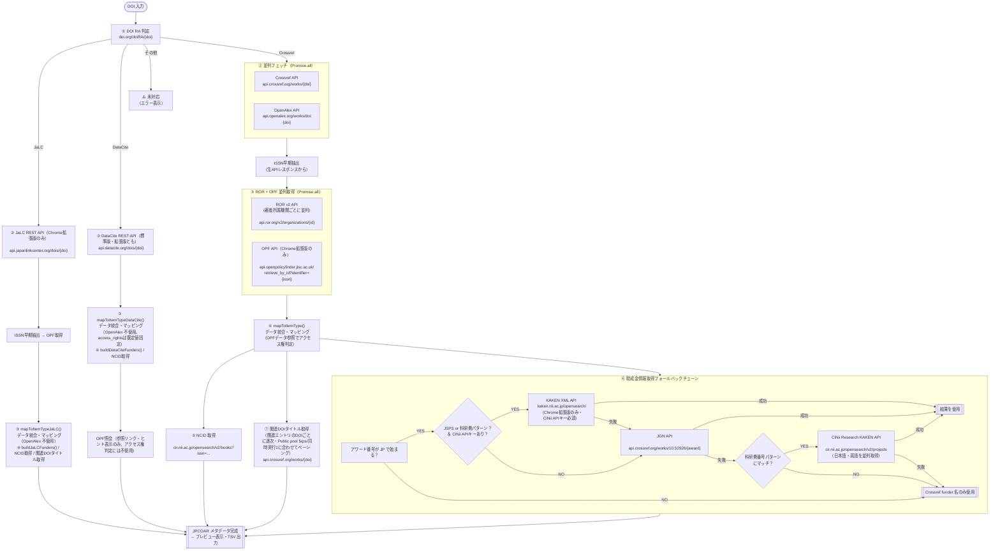

# make_jc_importer.html — API フロー整理

JAIRO Cloud インポート用 TSV 生成ツール（`make_jc_importer.html`）が、
DOI を入力として複数の API を呼び出し JPCOAR メタデータを生成するまでの
処理順序・データマッピングを図と表で整理したドキュメントです。

---

## 1. 全体フロー図



> **注意：** KAKEN XML API（`kaken.nii.ac.jp/opensearch/`）および OPF API（`api.openpolicyfinder.jisc.ac.uk`）は CORS 非対応のため通常ブラウザ版では利用不可。Chrome拡張版では Service Worker 経由で CORS 回避して利用可能です。DataCite REST API は CORS 対応・認証不要のため、標準版・Chrome拡張版とも直接 `fetch()` で利用できます。

---

## 2. API 一覧と呼び出しタイミング

| # | API 名 | エンドポイント | 呼び出しタイミング | 認証 |
|---|--------|--------------|-----------------|------|
| 1 | DOI RA 判定 | `https://doi.org/doiRA/{doi}` | 最初・同期的に実行 | 不要 |
| 2 | Crossref | `https://api.crossref.org/works/{doi}` | RA 判定後（OpenAlex と並列） | 不要 |
| 3 | OpenAlex | `https://api.openalex.org/works/doi:{doi}` | RA 判定後（Crossref と並列） | 任意（API Key） |
| 4 | ROR v2 | `https://api.ror.org/v2/organizations/{ror_id}` | ISSN早期抽出後（OPF と並列で取得） | 不要 |
| 5 | OPF (Open Policy Finder) | `https://api.openpolicyfinder.jisc.ac.uk/retrieve_by_id?identifier={issn}` | ISSN早期抽出後（ROR と並列で取得、Chrome拡張版のみ） | 必要（API Key） |
| 6 | JaLC REST API | `https://api.japanlinkcenter.org/v2/dois/{doi}` | JaLC DOI の場合（Chrome拡張版のみ） | 不要 |
| 7 | CiNii Research (NCID) | `https://cir.nii.ac.jp/opensearch/v2/books?issn={issn}&format=json` | mapToItemType / mapToItemTypeJaLC 内・ISSN ごと | 任意（API Key） |
| 8 | KAKEN XML API | `https://kaken.nii.ac.jp/opensearch/` | 助成金処理の最優先（JSPS/科研費パターン＆CiNii APIキーあり、Chrome拡張版のみ） | 必要（CiNii API Key） |
| 9 | JGN (Crossref) | `https://api.crossref.org/works/10.52926/{award}` | KAKEN XML失敗後のフォールバック（アワード番号が JP で始まる場合）。アワード処理自体は並列だが、Crossref HTTP試行は共通ゲートで同時実行1・開始間隔250ms以上に制御 | 不要 |
| 10 | CiNii Research (KAKEN) | `https://cir.nii.ac.jp/opensearch/v2/projects?format=json&projectId={id}` | KAKEN XML・JGN いずれも失敗かつ科研費番号パターンにマッチの場合（最終フォールバック） | 任意（API Key） |
| 11 | Crossref (関連 DOI) | `https://api.crossref.org/works/{doi}` | 関連エントリの DOI タイトル取得（逐次・共通ゲートでペーシング） | 不要 |
| 12 | DataCite REST API | `https://api.datacite.org/dois/{doi}?publisher=true&affiliation=true` | DataCite DOI の場合（標準版・Chrome拡張版とも） | 不要 |

---

## 3. データマッピング表

### 3-a. Crossref API → 出力フィールド

| Crossref レスポンスフィールド | 出力フィールド（JPCOAR 項目） | JPCOAR項目名 | 変換・備考 |
|---------------------------|--------------------------|------------|-----------|
| `DOI` | `relation18` (isIdenticalTo / DOI) | 関連情報 | `https://doi.org/` を付加 |
| `title[0]` | `title0[].subitem_title` | タイトル | そのまま（言語警告フラグあり） |
| `author[].family` / `.given` | `creator2[].familyNames` / `.givenNames` | 作成者 | **Crossref のみ**（OpenAlex フォールバックなし） |
| `author[].ORCID` | `creator2[].nameIdentifiers[].nameIdentifier` | 作成者 | **Crossref 優先**（なければ OpenAlex 参照 → 警告フラグ付与） |
| `published-online` / `published-print.date-parts[0]` | `date11[].subitem_date_issued_datetime` (Issued) | 日付 | YYYY-MM-DD 形式 |
| `accepted.date-parts[0]` | `date11[].subitem_date_issued_datetime` (Accepted) | 日付 | YYYY-MM-DD 形式 |
| `submitted.date-parts[0]` | `date11[].subitem_date_issued_datetime` (Submitted) | 日付 | YYYY-MM-DD 形式 |
| `abstract` | `description9[].subitem_description` | 内容記述 | JATS タグ（`<jats:...>`）を除去 |
| `publisher` | `publisher10[].subitem_publisher` | 出版者 | そのまま |
| `issn-type[]` / `ISSN[]` | `source_identifier22[].subitem_source_identifier` | 収録物識別子 | electronic→EISSN, print→PISSN, その他→ISSN |
| `container-title[0]` | `source_title23[].subitem_source_title` | 収録物名 | そのまま |
| `volume` | `volume_number24.subitem_volume` | 巻 | そのまま |
| `issue` | `issue_number25.subitem_issue` | 号 | そのまま |
| `page` | `page_start27` / `page_end28` | 開始ページ / 終了ページ | `-` で分割 |
| `license[].URL`（content-version=vor） | `rights6[].subitem_rights_resource` | 権利情報 | そのまま |
| `assertion[]`（label=Copyright） | `rights6[].subitem_rights` | 権利情報 | そのまま |
| `type` | `resource_type13.resourcetype` | 資源タイプ | `CROSSREF_TYPE_MAP` で JPCOAR 種別に変換 |
| `isbn-type[]` / `ISBN[]` | `relation18[]` (isIdenticalTo / ISBN) | 関連情報 | |
| `relation{}` | `relation18[]` | 関連情報 | `CROSSREF_RELATION_TYPE_MAP` で関連情報の属性を変換 |
| `funder[]` | `funding_reference21[]` | 助成情報 | `buildFunders()` で API 拡張（下記参照） |

### 3-b. OpenAlex API → 出力フィールド

| OpenAlex レスポンスフィールド | 出力フィールド（JPCOAR 項目） | JPCOAR項目名 | 変換・備考 |
|---------------------------|--------------------------|------------|----------|
| `open_access.is_oa` / `.oa_status` | UI の OA バッジ表示 | — | diamond→💎, gold→🟡, hybrid→🔵, bronze→🟠, green→🟢, closed→🔴 |
| `open_access.oa_status` | `version_type15.subitem_version_type` | 出版タイプ | `determineVersionInfo()` で判定（§5 参照） |
| `authorships[].author.orcid` | `creator2[].nameIdentifiers[].nameIdentifier` | 作成者 | **Crossref に ORCID がない場合のみ使用**（`_warnOrcid: true` フラグ付与、UI に警告表示） |
| `authorships[].institutions[].ror` | ROR v2 API 呼び出しトリガー | — | **OpenAlex のみ参照**（Crossref の所属は不使用） |
| `authorships[].institutions[].display_name` | `creator2[].creatorAffiliations[].affiliationNames[]` | 作成者 | ROR から取得できた場合は ROR の表示名を優先 |
| `ids.pmid` / `.mag` など | `relation18[]` (isIdenticalTo / PMID 等) | 関連情報 | DOI・OpenAlex キーは除外。VALID_RELATION_ID_TYPES に含まれる種別のみ追加 |

#### 著者情報における Crossref / OpenAlex の使い分けまとめ

| 著者フィールド | 取得元 | 詳細 |
|-------------|--------|------|
| 姓（family） | **Crossref のみ** | `crA.family` |
| 名（given） | **Crossref のみ** | `crA.given` |
| ORCID | **Crossref 優先 → OpenAlex フォールバック** | `crA.ORCID \|\| oaEntry?.author?.orcid`。OpenAlex 由来の場合は `_warnOrcid: true` フラグを付与し「OpenAlexから取得した値です。正確か確認してください」と警告表示 |
| 所属機関名 | **OpenAlex のみ** | `oaEntry?.institutions[].display_name`（ROR 名称があれば優先） |
| 所属機関 ROR | **OpenAlex のみ** | `oaEntry?.institutions[].ror` → ROR v2 API 呼び出しに使用 |

### 3-c. ROR v2 API → 出力フィールド

| ROR レスポンスフィールド | 出力フィールド（JPCOAR 項目） | JPCOAR項目名 | 変換・備考 |
|----------------------|--------------------------|------------|-----------|
| `names[]`（type=ror_display の value） | `creator2[].creatorAffiliations[].affiliationNames[].affiliationName` | 所属機関名 | 優先表示名。取得できない場合は OpenAlex の display_name にフォールバック |
| `external_ids[]`（type=isni の all[0]） | `creatorAffiliations[].affiliationNameIdentifiers[]` (ISNI) | 所属機関識別子 | スペース除去済み |
| `id`（ROR ID 部分のみ） | `creatorAffiliations[].affiliationNameIdentifiers[]` (ROR) | 所属機関識別子 | `https://ror.org/{id}` |

### 3-d. 出版者情報（publisherDetail）マッピング

| API | レスポンスフィールド | 出力フィールド（JPCOAR 項目） | JPCOAR項目名 | 変換・備考 |
|----|----------------|--------------------------|------------|-----------|
| Crossref | `publisher` | `item_1698624005[].publisher_names[].publisher_name` | 出版者名 | そのまま（lang=en） |
| Crossref | `publisher-location` | `item_1698624005[].publisher_locations[].publisher_location` | 出版地 | そのまま（lang=en） |
| JaLC | `publisher_list[].publisher_name` | `item_1698624005[].publisher_names[].publisher_name` | 出版者名 | 多言語対応（lang フィールド参照） |
| JaLC | `publisher_list[].location` | `item_1698624005[].publisher_locations[].publisher_location` | 出版地 | 多言語対応 |

> `item_1698624005` は JPCOAR 2.0 で追加された出版者情報フィールド（4サブ配列: publisher_names / publisher_locations / publication_places / publisher_descriptions）。

### 3-e. CiNii Research (NCID) → 出力フィールド

| CiNii レスポンスフィールド | 出力フィールド（JPCOAR 項目） | JPCOAR項目名 | 変換・備考 |
|------------------------|--------------------------|------------|-----------|
| `items[0].dc:identifier`（@type=cir:NCID） | `source_identifier22[].subitem_source_identifier` (NCID) | 収録物識別子 | ISSN から逆引き。複数 ISSN のうち最初にヒットした結果を使用 |

### 3-f. JGN / KAKEN XML / CiNii Research KAKEN → 出力フィールド

| API | レスポンスフィールド | 出力フィールド（JPCOAR 項目） | JPCOAR項目名 | 備考 |
|----|----------------|--------------------------|------------|------|
| JGN (Crossref) | `project[0]['project-title'][].title` | `funding_reference21[].subitem_award_titles[].subitem_award_title` | 研究課題名 |  |
| JGN (Crossref) | `funder[0].name` | `funding_reference21[].subitem_funder_names[].subitem_funder_name` | 助成機関名 |  |
| JGN (Crossref) | `funder[0].DOI` | `funding_reference21[].subitem_funder_identifiers.subitem_funder_identifier` | 助成機関識別子 | `https://doi.org/{DOI}` |
| JGN (Crossref) | `funding[].scheme`（識別子） | `funding_reference21[].subitem_funding_stream_identifiers[].subitem_funding_stream_identifier` | プログラム情報識別子 | JGN スキーム識別子をそのまま設定 |
| JGN (Crossref) | `funding[].scheme`（名称変換） | `funding_reference21[].subitem_funding_streams[].subitem_funding_stream` | プログラム情報 | スキーム識別子から日英名称に変換 |
| KAKEN XML | `grantAward/title`（ja/en） | `funding_reference21[].subitem_award_titles[]` | 研究課題名 | 日英並列。Chrome拡張版で最優先で呼ばれる |
| KAKEN XML | `grantAward/member` | `creator2[]`（KAKEN著者情報） | 作成者 | ORCID一致で著者マッチ・日本語名取得（#8 予定） |
| KAKEN XML | `normalizedValue`（補正後番号） | `funding_reference21[].subitem_award_numbers.subitem_award_number` | 研究課題番号 | 補助金番号→研究課題番号へ自動補正 |
| KAKENHI（固定値） | — | 上記 2 フィールド | プログラム情報・プログラム情報識別子 | 科研費課題には `KAKENHI_FUNDING_STREAM` 定数の固定値を自動設定（日英） |
| JGN (Crossref) | `normalizedValue`（補正後番号） | `funding_reference21[].subitem_award_numbers.subitem_award_number` | 研究課題番号 | 補助金番号→研究課題番号へ自動補正。補正した場合は `_supplementaryWarning` フラグで警告表示 |
| JGN (Crossref) | `kakenUrl` | `funding_reference21[].subitem_award_numbers.subitem_award_uri` | 研究課題番号URI | KAKEN ページ URL |
| CiNii KAKEN | `items[0].title`（ja） | `funding_reference21[].subitem_award_titles[]`（lang=ja） | 研究課題名 | 日本語課題名 |
| CiNii KAKEN | `items[0].title`（en, lang=en クエリ） | `funding_reference21[].subitem_award_titles[]`（lang=en） | 研究課題名 | 英語課題名（日英並列取得） |
| CiNii KAKEN | `items[0]['dc:source'][@id]` | `funding_reference21[].subitem_award_numbers.subitem_award_uri` | 研究課題番号URI | KAKEN ページ URL |

### 3-g. DataCite API → 出力フィールド（概要）

DataCite パスは `mapToItemTypeDataCite()` / `buildDataCiteAuthors()` / `buildDataCiteFunders()` で処理されます。フィールド単位の完全な対応表（資源タイプ34値・関連タイプ39値・日付・言語2系統・位置情報等）は仕様書 [docs/datacite_jpcoar_mapping.md](docs/datacite_jpcoar_mapping.md) に集約されているため、ここでは Crossref/JaLC パスとの主な差異のみ記載します。

| 観点 | Crossref/JaLC パス | DataCite パス |
|------|-------------------|---------------|
| 収録物情報の主ソース | Crossref: `container-title`、JaLC: `journal_title_name_list` | `relatedItems[]`（`relatedItemType: Journal`）を主ソースとし、`container` で補完（`container.title` の充足率が低いため） |
| 助成機関識別子の取得元 | `funder[].DOI` / `funder_identifier_list` | `fundingReferences[].funderIdentifier`（`funderIdentifierType` が ROR/ISNI の場合も対応） |
| 研究課題名 | KAKEN XML/JGN/CiNii Research の結果に依存 | 上記に加え `fundingReferences[].awardTitle` をフォールバックとして使用可能（DataCiteのみ持つ利点） |
| アクセス権・出版タイプ | Crossref: OpenAlex OAステータスで動的判定、JaLC: OPFエンバーゴ連動 | **既定値固定**（`open access`、出版タイプは未設定）。OpenAlex連携なしのため自動判定しない。OPF照会は行うが参照リンク・ヒント表示のみに使用 |
| その他のタイトル・時間的範囲・位置情報 | 未実装 | `titles[].titleType` → その他のタイトル、`dates[].dateType: Coverage` → 時間的範囲、`geoLocations[]` → 位置情報（point/box/place）にそれぞれ対応 |

---

## 4. 助成金情報取得フォールバックチェーン詳細

```
buildFunders(crJson.funder) を各アワード番号について実行：

アワード番号が "JP" で始まる？
  YES:
    ① KAKEN XML API を試行（JSPS or 科研費パターン かつ CiNii APIキーあり の場合）
       https://kaken.nii.ac.jp/opensearch/?appid={CiNii_API_KEY}&...
       ※ Chrome拡張版のみ（CORS非対応のため extensionFetch() 経由）
       ├─ 成功 → KAKEN 結果（課題名・補助金番号→研究課題番号補正）を使用
       └─ 失敗 → ② へ

    ② JGN API を試行
       https://api.crossref.org/works/10.52926/{awardNumber}
       ├─ 成功 → JGN 結果（課題名・助成機関名・識別子・プログラム情報）を使用
       └─ 失敗 → ③ へ

    ③ 科研費番号パターンにマッチ（isKakenhi() による判定） かつ アワード番号あり？
       YES: CiNii Research KAKEN API を試行（日本語・英語を並列取得）
            https://cir.nii.ac.jp/opensearch/v2/projects?projectId={id}&format=json
            https://cir.nii.ac.jp/opensearch/v2/projects?projectId={id}&lang=en&format=json
            ├─ 成功 → CiNii 結果を使用
            └─ 失敗 → Crossref の funder 名のみ使用
       NO:  Crossref の funder 名のみ使用

  NO:
    Crossref の funder 名のみ使用（API 呼び出しなし）

※ KAKEN XML API および OPF API は CORS 非対応のため通常ブラウザ版では利用不可。
   Chrome拡張版では Service Worker（extensionFetch()）経由で CORS 回避して利用可能。
```

---

## 5. 固定値・自動設定フィールド（API 取得なし）

| 出力フィールド | JPCOAR項目名 | 設定値 | 設定方法 |
|-------------|------------|-------|---------|
| `access_rights4.subitem_access_right` | アクセス権 | `"open access"` / `"embargoed access"` | `determineAccessRights()` で動的判定（下記参照） |
| `access_rights4.subitem_access_right_uri` | アクセス権URI | `ACCESS_RIGHTS_MAP` から対応URI | 同上 |
| `language12[].subitem_language` | 言語 | `"eng"` | 常に固定（`_warnLang: true` 警告付き） |
| `version_type15.subitem_version_type` | 出版タイプ | Diamond/Gold/Hybrid/Bronze → `"VoR"`、Green/Closed → locations[].version で判定（VoR/AM/SMUR） | `determineVersionInfo()` で自動判定 |
| `version_type15.subitem_version_resource` | 出版タイプURI | VoR → `c_970fb48d4fbd8a85`、AM → `c_ab4af688f83e57aa`、SMUR → `c_71e4c1898caa6e32` | 同上 |
| `system.publish_status` | — | `"private"` | 常に固定 |
| `system.pubdate` | 公開日 | 実行日の日付（YYYY-MM-DD） | `todayStr()` 関数 |

> **DataCite パスの例外：** 上記の `access_rights4` の動的判定（`determineAccessRights()`）と `version_type15` の自動判定（`determineVersionInfo()`）は Crossref/JaLC パス専用です。DataCite パスは OpenAlex 連携を行わないため、`access_rights4.subitem_access_right` は常に `"open access"` 固定、`version_type15` は全サブフィールド空欄で出力されます。OPF 照会は行いますが、参照リンク・ヒント表示にのみ使用し、アクセス権の自動判定には使いません。

#### アクセス権判定ロジック（`determineAccessRights()`）

```
OAステータスが diamond/gold/hybrid/bronze/green のいずれか？
  → "open access"

上記以外（closed / 空文字 / unknown）:
  OPF データにエンバーゴ情報あり（embargo.amount > 0）？
    → "embargoed access"
  OPF データなし or エンバーゴなし
    → "open access"（機関リポジトリ登録用途を想定）
```

#### 出版タイプ判定ロジック（`determineVersionInfo()`）

```
OAステータスが diamond/gold/hybrid/bronze？
  → VoR（出版社版） + relationType=isIdenticalTo

OAステータスが green/closed？
  → OpenAlex locations[].version フィールドで判定:
    publishedVersion → VoR + isIdenticalTo
    acceptedVersion  → AM  + isVersionOf
    submittedVersion → SMUR + isVersionOf
    不明             → AM  + isVersionOf（デフォルト）
```

---

## 6. 空フィールド（手動入力用プレースホルダー）

以下のフィールドは API から取得せず、空の状態でプレビューに表示される：

| フィールド | 用途 |
|----------|------|
| `alternative_title1` | その他のタイトル |
| `contributor3` | 寄与者 |
| `rights_holder7` | 権利者情報 |
| `subject8` | 主題（スキーム・値とも空） |
| `version14` | バージョン番号 |
| `identifier16` | 識別子 |
| `identifier_registration17` | ID 登録 |
| `temporal19` | 時間的範囲 |
| `geolocation20` | 位置情報 |
| `number_of_pages26` | ページ数 |
| `conference34` | 会議記述 |
