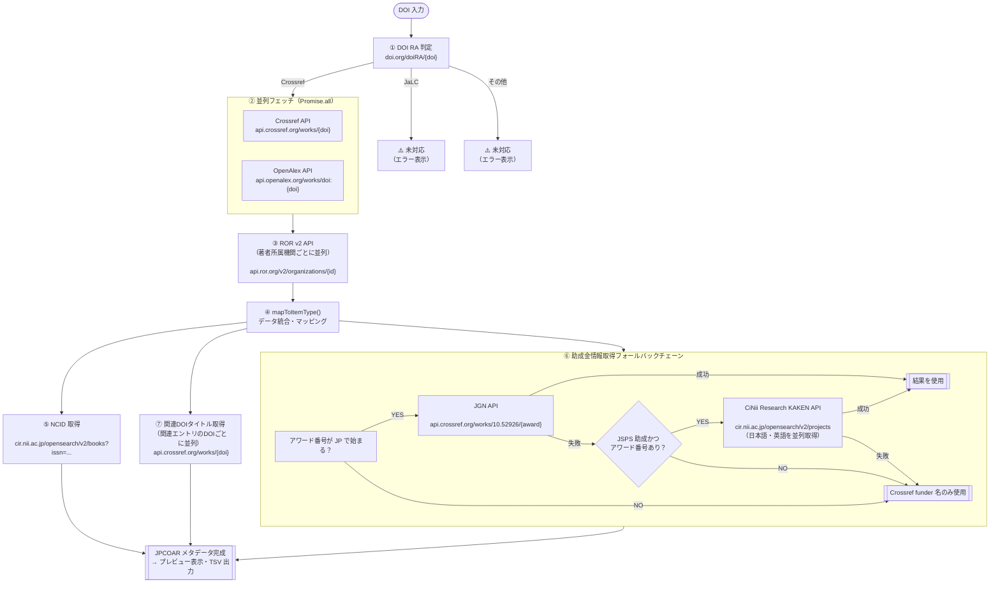

# make_jc_importer.html — API フロー整理

JAIRO Cloud インポート用 TSV 生成ツール（`make_jc_importer.html`）が、
DOI を入力として複数の API を呼び出し JPCOAR メタデータを生成するまでの
処理順序・データマッピングを図と表で整理したドキュメントです。

---

## 1. 全体フロー図



> **注意：** KAKEN XML API（`kaken.nii.ac.jp/opensearch/`）は CORS 非対応のためコード上で暫定スキップされており、現在は呼び出されません。

---

## 2. API 一覧と呼び出しタイミング

| # | API 名 | エンドポイント | 呼び出しタイミング | 認証 |
|---|--------|--------------|-----------------|------|
| 1 | DOI RA 判定 | `https://doi.org/doiRA/{doi}` | 最初・同期的に実行 | 不要 |
| 2 | Crossref | `https://api.crossref.org/works/{doi}` | RA 判定後（OpenAlex と並列） | 不要 |
| 3 | OpenAlex | `https://api.openalex.org/works/doi:{doi}` | RA 判定後（Crossref と並列） | 任意（API Key） |
| 4 | ROR v2 | `https://api.ror.org/v2/organizations/{ror_id}` | OpenAlex 取得後（機関ごとに並列） | 不要 |
| 5 | CiNii Research (NCID) | `https://cir.nii.ac.jp/opensearch/v2/books?issn={issn}&format=json` | mapToItemType 内・ISSN ごと | 任意（API Key） |
| 6 | JGN (Crossref) | `https://api.crossref.org/works/10.52926/{award}` | 助成金処理（アワード番号が JP で始まる場合） | 不要 |
| 7 | CiNii Research (KAKEN) | `https://cir.nii.ac.jp/opensearch/v2/projects?format=json&projectId={id}` | JGN 失敗かつ JSPS 助成の場合（フォールバック） | 任意（API Key） |
| 8 | Crossref (関連 DOI) | `https://api.crossref.org/works/{doi}` | 関連エントリの DOI タイトル取得（並列） | 不要 |
| ~~-~~ | ~~KAKEN XML API~~ | ~~`https://kaken.nii.ac.jp/opensearch/`~~ | ~~CORS 非対応のため現在スキップ~~ | ~~必要~~ |

---

## 3. データマッピング表

### 3-a. Crossref API → 出力フィールド

| Crossref レスポンスフィールド | 出力フィールド（JPCOAR 項目） | JPCOAR項目名 | 変換・備考 |
|---------------------------|--------------------------|------------|-----------|
| `DOI` | `relation18` (isIdenticalTo / DOI) | 関連情報 | `https://doi.org/` を付加 |
| `title[0]` | `title0[].subitem_title` | タイトル | そのまま（言語警告フラグあり） |
| `author[].family` / `.given` | `creator2[].familyNames` / `.givenNames` | 作成者 | **Crossref のみ**（OpenAlex フォールバックなし） |
| `author[].ORCID` | `creator2[].nameIdentifiers[].nameIdentifier` | 作成者 | **Crossref 優先**（なければ OpenAlex 参照 → 警告フラグ付与） |
| `published-online` / `published-print.date-parts[0]` | `date11[].subitem_date_issued_datetime` (Issued) | 日付 | YYYY-MM-DD 形式 |
| `accepted.date-parts[0]` | `date11[].subitem_date_issued_datetime` (Accepted) | 日付 | YYYY-MM-DD 形式 |
| `submitted.date-parts[0]` | `date11[].subitem_date_issued_datetime` (Submitted) | 日付 | YYYY-MM-DD 形式 |
| `abstract` | `description9[].subitem_description` | 内容記述 | JATS タグ（`<jats:...>`）を除去 |
| `publisher` | `publisher10[].subitem_publisher` | 出版者 | そのまま |
| `issn-type[]` / `ISSN[]` | `source_identifier22[].subitem_source_identifier` | 収録物識別子 | electronic→EISSN, print→PISSN, その他→ISSN |
| `container-title[0]` | `source_title23[].subitem_source_title` | 収録物名 | そのまま |
| `volume` | `volume_number24.subitem_volume` | 巻 | そのまま |
| `issue` | `issue_number25.subitem_issue` | 号 | そのまま |
| `page` | `page_start27` / `page_end28` | 開始ページ / 終了ページ | `-` で分割 |
| `license[].URL`（content-version=vor） | `rights6[].subitem_rights_resource` | 権利情報 | そのまま |
| `assertion[]`（label=Copyright） | `rights6[].subitem_rights` | 権利情報 | そのまま |
| `type` | `resource_type13.resourcetype` | 資源タイプ | `CROSSREF_TYPE_MAP` で JPCOAR 種別に変換 |
| `isbn-type[]` / `ISBN[]` | `relation18[]` (isIdenticalTo / ISBN) | 関連情報 | |
| `relation{}` | `relation18[]` | 関連情報 | `CROSSREF_RELATION_TYPE_MAP` で関連情報の属性を変換 |
| `funder[]` | `funding_reference21[]` | 助成情報 | `buildFunders()` で API 拡張（下記参照） |

### 3-b. OpenAlex API → 出力フィールド

| OpenAlex レスポンスフィールド | 出力フィールド（JPCOAR 項目） | JPCOAR項目名 | 変換・備考 |
|---------------------------|--------------------------|------------|----------|
| `open_access.is_oa` / `.oa_status` | UI の OA バッジ表示 | — | gold→🟡, green→🟢, hybrid→🔵, closed→🔴 |
| `open_access.oa_status` | `version_type15.subitem_version_type` | 出版タイプ | gold / hybrid → VoR、それ以外 → AM |
| `authorships[].author.orcid` | `creator2[].nameIdentifiers[].nameIdentifier` | 作成者 | **Crossref に ORCID がない場合のみ使用**（`_warnOrcid: true` フラグ付与、UI に警告表示） |
| `authorships[].institutions[].ror` | ROR v2 API 呼び出しトリガー | — | **OpenAlex のみ参照**（Crossref の所属は不使用） |
| `authorships[].institutions[].display_name` | `creator2[].creatorAffiliations[].affiliationNames[]` | 作成者 | ROR から取得できた場合は ROR の表示名を優先 |
| `ids.pmid` / `.mag` など | `relation18[]` (isIdenticalTo / PMID 等) | 関連情報 | DOI・OpenAlex キーは除外。VALID_RELATION_ID_TYPES に含まれる種別のみ追加 |

#### 著者情報における Crossref / OpenAlex の使い分けまとめ

| 著者フィールド | 取得元 | 詳細 |
|-------------|--------|------|
| 姓（family） | **Crossref のみ** | `crA.family` |
| 名（given） | **Crossref のみ** | `crA.given` |
| ORCID | **Crossref 優先 → OpenAlex フォールバック** | `crA.ORCID \|\| oaEntry?.author?.orcid`。OpenAlex 由来の場合は `_warnOrcid: true` フラグを付与し「OpenAlexから取得した値です。正確か確認してください」と警告表示 |
| 所属機関名 | **OpenAlex のみ** | `oaEntry?.institutions[].display_name`（ROR 名称があれば優先） |
| 所属機関 ROR | **OpenAlex のみ** | `oaEntry?.institutions[].ror` → ROR v2 API 呼び出しに使用 |

### 3-c. ROR v2 API → 出力フィールド

| ROR レスポンスフィールド | 出力フィールド（JPCOAR 項目） | JPCOAR項目名 | 変換・備考 |
|----------------------|--------------------------|------------|-----------|
| `names[]`（type=ror_display の value） | `creator2[].creatorAffiliations[].affiliationNames[].affiliationName` | 所属機関名 | 優先表示名。取得できない場合は OpenAlex の display_name にフォールバック |
| `external_ids[]`（type=isni の all[0]） | `creatorAffiliations[].affiliationNameIdentifiers[]` (ISNI) | 所属機関識別子 | スペース除去済み |
| `id`（ROR ID 部分のみ） | `creatorAffiliations[].affiliationNameIdentifiers[]` (ROR) | 所属機関識別子 | `https://ror.org/{id}` |

### 3-d. CiNii Research (NCID) → 出力フィールド

| CiNii レスポンスフィールド | 出力フィールド（JPCOAR 項目） | JPCOAR項目名 | 変換・備考 |
|------------------------|--------------------------|------------|-----------|
| `items[0].dc:identifier`（@type=cir:NCID） | `source_identifier22[].subitem_source_identifier` (NCID) | 収録物識別子 | ISSN から逆引き。複数 ISSN のうち最初にヒットした結果を使用 |

### 3-e. JGN / CiNii Research KAKEN → 出力フィールド

| API | レスポンスフィールド | 出力フィールド（JPCOAR 項目） | JPCOAR項目名 | 備考 |
|----|----------------|--------------------------|------------|------|
| JGN (Crossref) | `project[0]['project-title'][].title` | `funding_reference21[].subitem_award_titles[].subitem_award_title` | 研究課題名 |  |
| JGN (Crossref) | `funder[0].name` | `funding_reference21[].subitem_funder_names[].subitem_funder_name` | 助成機関名 |  |
| JGN (Crossref) | `funder[0].DOI` | `funding_reference21[].subitem_funder_identifiers.subitem_funder_identifier` | 助成機関識別子 | `https://doi.org/{DOI}` |
| JGN (Crossref) | `normalizedValue`（補正後番号） | `funding_reference21[].subitem_award_numbers.subitem_award_number` | 研究課題番号 | 補助金番号→研究課題番号へ自動補正。補正した場合は `_supplementaryWarning` フラグで警告表示 |
| JGN (Crossref) | `kakenUrl` | `funding_reference21[].subitem_award_numbers.subitem_award_uri` | 研究課題番号URI | KAKEN ページ URL |
| CiNii KAKEN | `items[0].title`（ja） | `funding_reference21[].subitem_award_titles[]`（lang=ja） | 研究課題名 | 日本語課題名 |
| CiNii KAKEN | `items[0].title`（en, lang=en クエリ） | `funding_reference21[].subitem_award_titles[]`（lang=en） | 研究課題名 | 英語課題名（日英並列取得） |
| CiNii KAKEN | `items[0]['dc:source'][@id]` | `funding_reference21[].subitem_award_numbers.subitem_award_uri` | 研究課題番号URI | KAKEN ページ URL |

---

## 4. 助成金情報取得フォールバックチェーン詳細

```
buildFunders(crJson.funder) を各アワード番号について実行：

アワード番号が "JP" で始まる？
  YES:
    ① JGN API を試行
       https://api.crossref.org/works/10.52926/{awardNumber}
       ├─ 成功 → JGN 結果（課題名・助成機関名・識別子）を使用
       └─ 失敗 → ② へ

    ② JSPS 助成 (funderDOI === JSPS_FUNDER_DOI) かつ アワード番号あり？
       YES: CiNii Research KAKEN API を試行（日本語・英語を並列取得）
            https://cir.nii.ac.jp/opensearch/v2/projects?projectId={id}&format=json
            https://cir.nii.ac.jp/opensearch/v2/projects?projectId={id}&lang=en&format=json
            ├─ 成功 → CiNii 結果を使用
            └─ 失敗 → Crossref の funder 名のみ使用
       NO:  Crossref の funder 名のみ使用

  NO:
    Crossref の funder 名のみ使用（API 呼び出しなし）

※ KAKEN XML API（暫定スキップ）は CORS 非対応のため現在は常にスキップされる。
   CORS 解消時はフォールバックチェーンの先頭（JGN より前）に挿入される予定。
```

---

## 5. 固定値・自動設定フィールド（API 取得なし）

| 出力フィールド | JPCOAR項目名 | 設定値 | 設定方法 |
|-------------|------------|-------|---------|
| `access_rights4.subitem_access_right` | アクセス権 | `"open access"` | 常に固定 |
| `access_rights4.subitem_access_right_uri` | アクセス権 | `"http://purl.org/coar/access_right/c_abf2"` | 常に固定 |
| `language12[].subitem_language` | 言語 | `"eng"` | 常に固定（`_warnLang: true` 警告付き） |
| `version_type15.subitem_version_type` | 出版タイプ | Gold/Hybrid OA → `"VoR"`、その他 → `"AM"` | OpenAlex `open_access.oa_status` から自動判定 |
| `version_type15.subitem_version_resource` | 出版タイプ | VoR → `http://purl.org/coar/version/c_970fb48d4fbd8a85`、AM → `http://purl.org/coar/version/c_ab4af688f83e57aa` | 同上 |
| `system.publish_status` | — | `"private"` | 常に固定 |
| `system.pubdate` | 公開日 | 実行日の日付（YYYY-MM-DD） | `todayStr()` 関数 |

---

## 6. 空フィールド（手動入力用プレースホルダー）

以下のフィールドは API から取得せず、空の状態でプレビューに表示される：

| フィールド | 用途 |
|----------|------|
| `alternative_title1` | その他のタイトル |
| `contributor3` | 寄与者 |
| `rights_holder7` | 権利者情報 |
| `subject8` | 主題（スキーム・値とも空） |
| `version14` | バージョン番号 |
| `identifier16` | 識別子 |
| `identifier_registration17` | ID 登録 |
| `temporal19` | 時間的範囲 |
| `geolocation20` | 位置情報 |
| `number_of_pages26` | ページ数 |
| `conference34` | 会議記述 |
