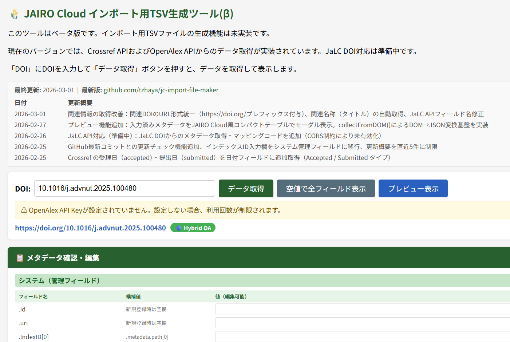
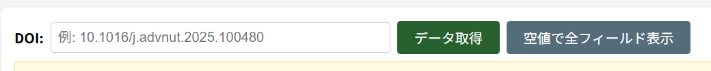
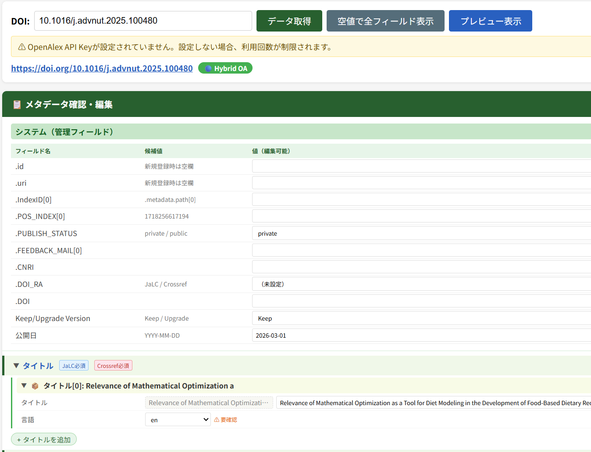
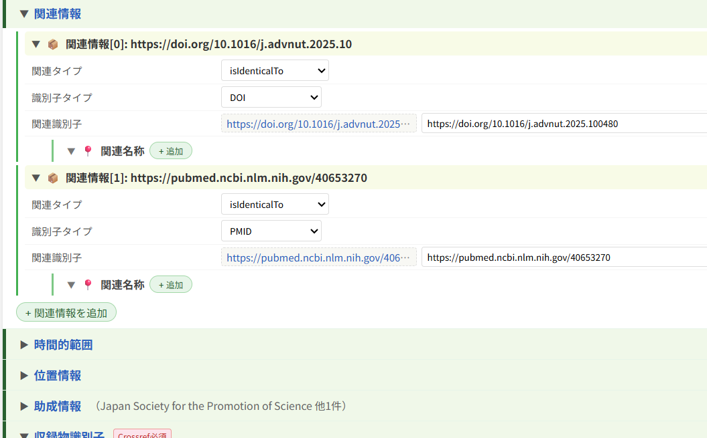
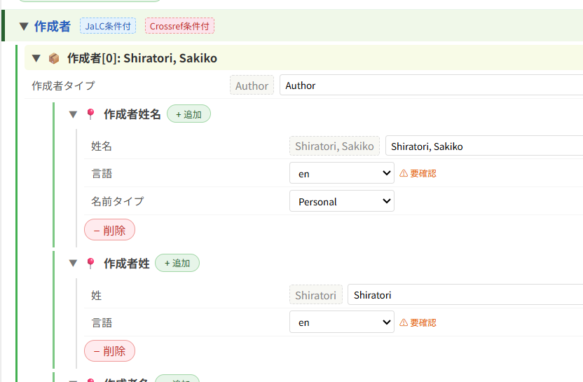
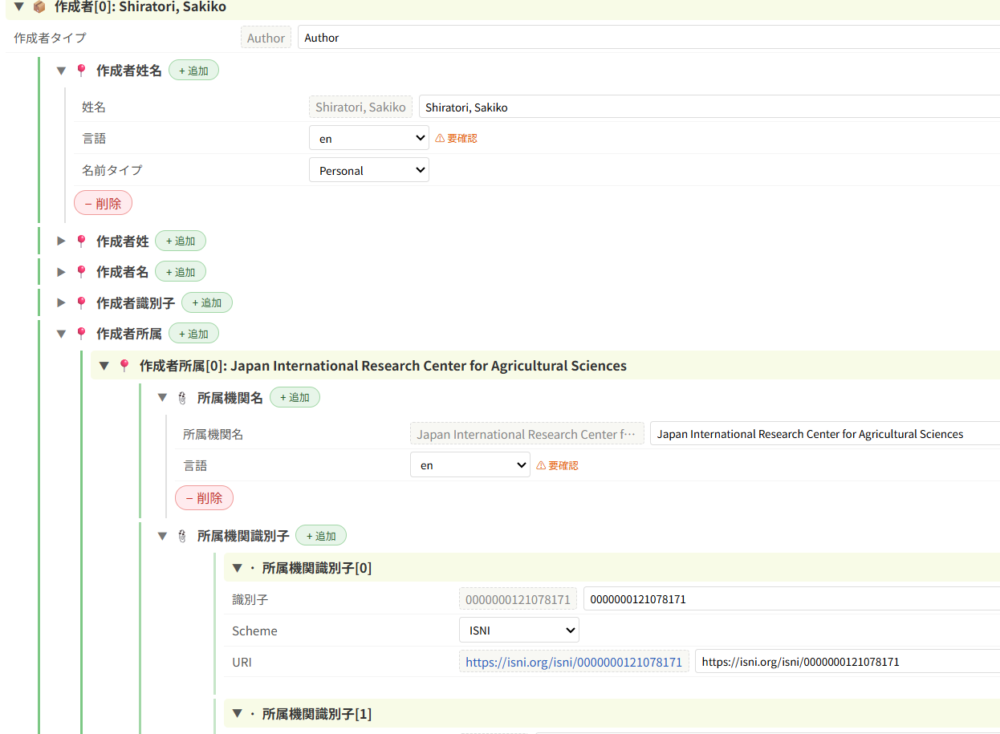
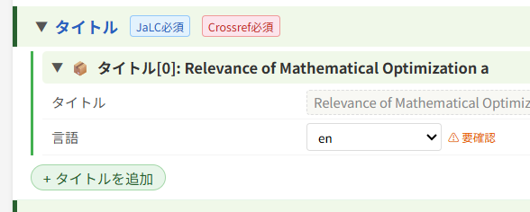
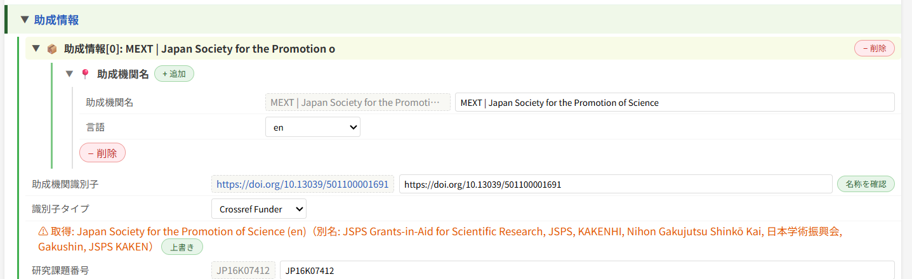
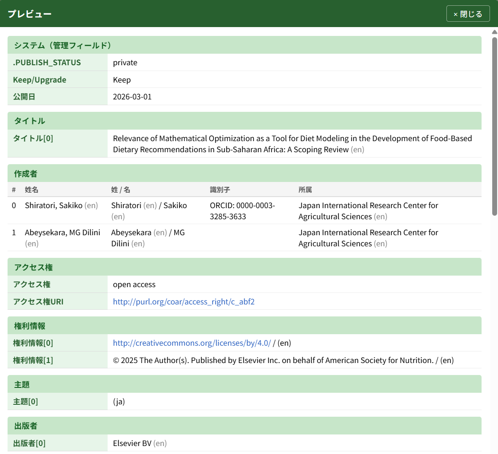

# JAIRO Cloud インポート用TSV生成ツール — 使い方ガイド

## このツールについて

JAIRO Cloud (WEKO3) にメタデータをインポートするためのTSVファイルを生成するツールです。DOIを入力するだけで、Crossref・OpenAlex・JaLC などのAPIからメタデータを自動取得し、JPCOAR スキーマに準拠した形式で編集・確認できます。

通常ブラウザ版は、3つのファイル（`make_jc_importer.html`・`shared.js`・`tsv_headers_template.js`）を同じフォルダに置いて `make_jc_importer.html` をブラウザで開くだけで使用でき、インストールは不要です。サイドパネルで利用できるChrome拡張機能版もあります（導入方法は [README](../README.md#導入方法) を参照）。

---

## 画面の構成

画面は大きく3つのエリアに分かれています。

| エリア | 説明 |
|--------|------|
| **DOI入力エリア** | DOIの入力と操作ボタン |
| **メタデータ確認・編集エリア** | 取得したメタデータの確認・手動編集 |
| **プレビューモーダル** | 入力内容の最終確認（ポップアップ表示） |



---

## 基本的な使い方

### STEP 1: DOIを入力してデータを取得する



1. **DOI入力欄** に対象論文のDOIを入力します
   - 例: `10.1016/j.advnut.2025.100480`
   - `https://doi.org/` 付きのURLでも入力できます
   - （Chrome拡張機能版のみ）電子ジャーナルの論文ページを開いた状態で **「ページからDOI取得」ボタン** をクリックすると、ページのmetaタグ（`citation_doi` など）からDOIを自動入力できます
2. **「データ取得」ボタン** をクリック（またはEnterキー）します
3. データ取得中は「⏳ データを取得中です…」と表示されます
4. 取得が完了すると、DOIリンクとオープンアクセス状態、（Chrome拡張のみ）Open Policy Finderへのリンクが表示され、下部にメタデータ編集エリアが出現します



> **ヒント:** DOIがわからない場合や、空のフォームから手入力したい場合は **「空値で全フィールド表示」ボタン** をクリックしてください。全フィールドが空の状態で表示されます。

### STEP 2: メタデータを確認・編集する

データ取得後、「📋 メタデータ確認・編集」セクションが表示されます。

#### 画面の見方

- **システム（管理フィールド）**: POS_INDEX などのシステム管理項目。「候補値」と「値（編集可能）」の2列があります
- **各メタデータセクション**: タイトル・作成者・日付など、フィールドごとにアコーディオン（折りたたみ）形式で表示されます



#### アコーディオン操作

- 各セクションの青字タイトルをクリックすると、JPCOARスキーマの説明が開きます
- 各セクション先頭の ▼ をクリックすると、そのセクションが **開閉** できます
- ヘッダー右側にはデータの概要（タイトルや著者名など）がグレー文字で表示されます

#### データの編集

- **テキスト入力欄**: 直接文字を入力・修正できます
- **プルダウン（選択肢）**: 資源タイプや言語など、定められた値から選択します
- **候補値（ヒントセル）**: 破線枠の灰色背景で表示される値はAPIから取得した参考値です。必要に応じて編集用セルにコピーしてください
- **読み取り専用フィールド**: 灰色背景で表示され、他のフィールドから自動設定されます（例: 出版タイプのURIは出版タイプ選択から自動決定）



#### エントリの追加・削除

配列形式のフィールド（著者・関連情報・助成情報など）では:

- **「+ 追加」ボタン**: 新しいエントリを追加します
- **「- 削除」ボタン**: 該当エントリを削除します



#### ファイル情報の追加

- ファイル情報セクションでは、インポートするファイル（PDF・画像）の情報を設定できます。
- Chrome拡張版では、エンバーゴがある場合にはその期間と公開可能となる日付の候補を表示します。確認して、入力をお願いします。

##### フォルダから一括追加（推奨）

1. ファイル情報セクションの **「フォルダを選択…」ボタン** をクリックします
2. `data/` フォルダ、または `data/` 以下のサブフォルダ（例: `data/rec_1/`）を選択します
3. フォルダ直下の PDF・画像ファイルが自動的にエントリとして追加されます

- **ファイルパスの自動設定**:
  - `data/` を選択した場合: パスはファイル名のみ（例: `paper.pdf`）
  - `data/rec_1/` を選択した場合: パスは `rec_1/paper.pdf`
- **オブジェクトタイプの自動判別**:
  - PDF → `fulltext`（本文）
  - 画像 → `thumbnail`（サムネイル）

##### 個別ファイル追加

- **「+ ファイル情報を追加」ボタン** でエントリを追加し、各エントリの「ファイル選択」でファイルを選択します
- ファイルパスは手動で編集できます

> **注意:** `data/` フォルダを上位ディレクトリとして持たないファイルは、WEKO3 インポート仕様に合致しません。ファイルは必ず `data/` 以下に配置してください。

---

### 各フィールドの詳細・補足

> 初めての利用では読み飛ばして構いません。各フィールドの自動取得内容や識別子逆引き機能について知りたい場合に参照してください。

#### データ取り込みの詳細

DOI (Crossref/DataCite/JaLC)から得られる情報を元に、OpenAlex、ROR、CiNii Research、KAKEN XML、JGN（Japan Grant Number）、Open Policy Finder（OPF）からの情報で補完しています。
詳しくは [api-flow.md](../api-flow.md) を参照してください。

1. 共通
   - 「⚠ 要確認」と赤字で表示された場合は、OpenAlexから取り込んだ情報を示します。
   - マウスオーバーで詳細が表示されます。適宜確認をお願いします。
2. 作成者
   - CrossrefからORCIDが得られた場合はそのまま、ない場合はOpenAlexから取得しています。
   - OpenAlexからORCIDを取得した場合は「⚠ 要確認」と警告を表示します。
   - **OpenAlex上のworkに付与されたORCIDは同姓同名などを誤判定していることがあります。必ず確認してください。**
3. 作成者所属
   - 所属機関名および所属機関識別子（ROR）は、OpenAlexから取得しています。
   - Crossrefから得られる情報には住所などの情報が入っている場合があり、JPCOARスキーマの仕様と合致しない場合があるためです。
   - RORからISNIを取得しています。
   - JPCOARスキーマ1.xではRORを入力するとIRDBのエラーチェックでエラーとなります。必要に応じて削除してください。
4. アクセス権
   - OpenAlexのOAステータスが open 系（diamond/gold/hybrid/bronze/green）の場合は `open access` を設定します。
   - Chrome拡張版では、OAステータスが closed または不明の場合、Open Policy Finder（OPF）APIからエンバーゴ情報を取得し、エンバーゴがある場合には `embargoed access` を自動設定します。
5. 出版タイプ
   - OpenAlexのOAステータスに基づいて自動判定されます。
   - diamond/gold/hybrid/bronze → VoR（出版社版）
   - green/closed → OpenAlexの locations[].version フィールドで判定（VoR/AM/SMUR）
   - 実際に掲載する版に合わせて修正してください。
6. 関連情報
   - Crossrefから得られたDOIの属性は、OAステータスに基づき自動設定されます（出版社版なら isIdenticalTo、著者最終稿なら isVersionOf）。
   - OpenAlexで他のリポジトリでの公開が確認された場合は、DOI/URI/Handleを取得して属性 isVersionOf として設定します。
7. 日付
   - 論文の出版日が設定されます。
   - Chrome拡張版では、エンバーゴがある場合にはその期間と公開可能となる日付の候補を表示します。確認して、入力をお願いします。
8. 収録物識別子
   - Crossrefから得られたISSNでCiNii Researchを検索し、ヒットした場合はNCIDを設定します。
   - Crossrefから得られたEISSNとPISSNを、いずれもない場合はISSNを設定します。
9. 権利情報
   - Crossrefから得られたライセンスのURLを設定します。
   - Crossrefのフィールド `assertion` に label=Copyright がある場合は、その値を設定します。
10. 助成情報
    - 助成機関名はCrossrefから得られた情報を使用しています。
    - 実際の機関名と一致しない場合があります（例: [逆引き結果の画像](#識別子の逆引き機能)）。「[識別子の逆引き機能](#識別子の逆引き機能)」を使って、Crossref Funder等から助成機関名を上書きできます。
11. 研究課題名
    - Chrome拡張版では、科研費課題の場合にKAKEN XML APIを最優先で使用して研究課題名・課題番号を取得します（補助金番号→研究課題番号の自動補正を含む）。
    - KAKEN XML APIで取得できない場合は、JGN（Japan Grant Number）APIを試行し、さらに失敗した場合はCiNii Research KAKEN APIにフォールバックします。
    - 通常ブラウザ版では、JGN API → CiNii Research KAKEN API の順で取得を試みます。
    - JSTの研究課題は、JGN APIから研究課題名・プログラム情報を取得して設定しています。
    - **研究課題番号タイプ**: JGN（Japan Grant Number）で取り込んだ体系的番号の場合、`JGN` を自動設定します（JPCOAR 2.0 の `awardNumberType`）。助成情報の編集フォームで「（未設定）/ JGN」から手動選択・修正もできます。KAKEN由来（科研費）の課題番号では空のままとなります。
12. 出版者情報
    - JPCOAR 2.0 の出版者情報フィールド（出版者名・出版地）を自動設定します。

#### DOI必須項目バッジ

- セクションヘッダーに色付きバッジが表示されることがあります。これはDOI登録時の必須項目を示します。
- マウスオーバーすると詳細が表示されます。

| バッジ | 意味 |
|--------|------|
| 赤・実線枠「Crossref 必須」 | Crossref DOI登録に必須 |
| 赤・破線枠「Crossref 条件付」 | Crossref DOI登録で条件により必須 |
| 青・実線枠「JaLC 必須」 | JaLC DOI登録に必須 |
| 青・破線枠「JaLC 条件付」 | JaLC DOI登録で条件により必須 |



#### 識別子からの逆引き機能

所属機関や助成機関のフィールドでは、識別子（ROR ID など）から機関名を逆引きできます。
科研費課題番号、JGN課題番号から、助成機関名、助成機関識別子を逆引きして補完することができます。

- 入力済みの識別子から自動で名称を取得し、結果を色で表示します
  - **緑**: 取得した名称と入力値が一致
  - **オレンジ**: 不一致（「上書き」ボタンで取得値に置き換え可能）
  - **赤**: 取得エラー



### STEP 3: 複数DOIを一括処理する（バッチ機能）

複数の論文をまとめて1つのTSVファイルに出力できます。

#### 基本フロー

1. 1件目のDOIを入力して **「データ取得」** → メタデータを確認・編集
2. 2件目のDOIを入力して **「データ取得」** → 1件目の編集内容は自動保存され、2件目の編集画面に切り替わります
3. 必要な件数分だけ繰り返します
4. 全件の編集が完了したら **「TSV出力」** → 全アイテムをまとめた1ファイルが出力されます

#### バッチパネル

DOIを取得すると、入力エリア下部に **蓄積アイテムパネル** が表示されます。

- 蓄積件数と各アイテムのDOI・タイトルが一覧表示されます
- 各アイテムの **✕ ボタン** で個別削除、**「全件クリア」ボタン** で全件削除ができます

#### ナビゲーションバナー

メタデータ編集エリアの上部に **ナビゲーションバナー** が表示されます。

- **「編集中: 2/3件」** のように、現在編集中のアイテム番号と総件数が表示されます
- 編集中のアイテムのDOIが併せて表示されます
- **「← 前」「次 →」ボタン** でアイテムを切り替えられます（編集内容は自動保存されます）
- バッチパネルのアイテムをクリックしても切り替え可能です

#### リポジトリURL

TSV出力時に、TSVヘッダー1行目のスキーマURLを機関リポジトリのURLに置き換えることができます。

- 入力エリアの **「リポジトリURL」** 欄に、あなたの機関リポジトリのURLを入力してください（例: `https://repo.example.ac.jp/`）
- 入力がない場合は `https://localhost/` が設定されます

#### TSV出力

- **1件のみ**: DOIをベースにしたファイル名（例: `10.1016_j.advnut.2025.100480.tsv`、DOI中の `/` は `_` に置換）で出力されます
- **複数件**: `import_YYYYMMDD_HHMMSS.tsv` のタイムスタンプ付きファイル名で出力されます
- TSVファイルは5行のヘッダー + N行のデータ行（アイテムごとに1行）で構成されます

### STEP 4: プレビューで最終確認する

1. 画面上部の **「プレビュー表示」ボタン**（青いボタン、データ取得後に出現）をクリックします
2. JAIRO Cloud のアイテム詳細画面に近いレイアウトで、入力済みメタデータがコンパクトに表示されます
3. 空のフィールドは自動的に省略されます
4. 閉じるには **「× 閉じる」ボタン**、**Escキー**、または **モーダル外のクリック** のいずれかを使います



---

## 作業中データの自動保存と復元

入力中・編集中のメタデータ（バッチに蓄積したアイテムを含む）は、**自動的にブラウザへ保存** されます。タブやサイドパネルを誤って閉じてしまっても、次回起動時に作業内容を復元できます。

### 保存のタイミング（自動）

次の操作のたびに、現在の作業内容が自動で保存されます。操作は不要です。

- データを取得したとき／バッチのアイテムを切り替え・削除したとき
- フィールドを編集したとき（入力が止まってから約1秒後）
- タブやサイドパネルを離れた（非表示にした）とき

### 復元のしかた

前回の作業データが残っている状態でツールを開くと、画面上部に **黄色い復元バナー** が表示されます。

- **「復元」ボタン**: 前回の続きから作業を再開します（蓄積件数・各アイテムの編集内容・編集中だったアイテムが戻ります）
- **「破棄」ボタン**: 前回のデータを削除し、新規の状態で開始します

> **ヒント:** 復元バナーは作業の邪魔にならないよう、操作するまで表示されたままになります。バナーを無視してそのまま新しいDOIを取得しても、前回の下書きはすぐには消えません。

### 下書きの手動削除

- 蓄積アイテムパネルの **「下書き削除」ボタン** で、保存済みの下書きデータをいつでも削除できます（画面に表示中の蓄積アイテムはそのまま残ります）。
- **TSV出力後も下書きは自動削除されません。** 同じ内容を再編集できるようにするためです。不要になったら「下書き削除」または「破棄」で消してください。

### 保存先とプライバシー

- 下書きはお使いのブラウザ内（Chrome拡張機能版は拡張機能のストレージ、通常ブラウザ版は `localStorage`）にのみ保存され、**外部には一切送信されません。**
- ブラウザの閲覧データ（サイト内データ）を消去すると下書きも削除されます。また、別のブラウザ・別のPCには引き継がれません。

---

## OpenAlex機関別著作検索からのインポート

自機関に所属する研究者が発表した論文を OpenAlex から検索し、登録対象のDOIをまとめてインポート用TSV生成ツールへ渡せます。Chrome拡張機能版ではサイドパネルの「OpenAlex機関別著作検索」タブ、通常ブラウザ版では `openalex_lookup.html` から利用します。

### 検索する

1. **ROR ID** を入力します（例: `https://ror.org/02956yf07`）。`https://ror.org/` 付きでも、ID部分のみでも入力できます。
   - 自機関の ROR ID を初期値として登録しておくと、タブ／ページを開いたときに自動入力されます（設定方法は [設定ガイド](settings.md) を参照）。
   - 自機関のROR IDは [ROR](https://ror.org/) で機関名から検索できます。
2. **過去N日**（既定90日）を指定します。OpenAlex の `from_publication_date`（**出版日**）を基準に、「今日からN日前以降に出版された論文」を検索します。
3. 必要に応じて **資源タイプ**（論文・図書・プレプリント等）で絞り込みます。
4. 「**検索**」を押すと、該当論文が一覧表示されます（チェックボックス・OA状況・タイトル・掲載誌・出版日・DOI）。一覧の上部に、検索条件（ROR ID・取得対象機関名・対象期間）が表示されます。

> **出版日ベースの注意:** 「最近 OpenAlex に収録されたが出版日は数か月前」という論文は、Nを小さくすると取りこぼします。Nは大きめ（既定90日）に取り、既登録分は後述の照合バッジと目視で除外する運用を想定しています。

### インポートへ渡す

1. 一覧で登録対象とする論文の **チェックボックス** を選びます（「全選択」「全解除」も使えます）。
2. 受け渡し方法は2通りです。
   - 「**選択DOIをコピー**」: 選択したDOIを改行区切りでクリップボードにコピーします。インポート用TSV生成ツールの「DOIリスト一括取得」のテキストエリアに貼り付けてください。
   - （Chrome拡張機能版のみ）「**インポートタブへ送る**」: 選択DOIを「JAIRO Cloud インポート用TSV生成ツール」タブへ直接送り、「DOIリスト一括取得」欄に自動入力します。
3. あとは通常の一括取得フロー（[STEP 3](#step-3-複数doiを一括処理するバッチ機能)）と同じく、順次メタデータを取得・編集して一括TSV出力できます。

> 検索結果・選択状態・照合結果は自動保存され、次回タブ／ページを開いたときに既定で表示されます（再検索すると入れ替わります）。

### 自機関リポジトリでの登録状況の判定（Chrome拡張機能版のみ）

「**リポジトリURL**」欄に自機関リポジトリのURLを入力すると、各候補の行に登録状況バッジが付きます。OpenSearch は DOI を直接指定して検索できないため、**候補のタイトルで検索し、返ってきたレコードのDOIと突き合わせて**判定します（OpenSearch は CORS 制約のため、この照合は拡張機能版でのみ動作します。通常ブラウザ版では照合列は表示されません）。

判定の流れ:

1. 候補論文のタイトルを正規化します（HTMLタグ片を除去し、先頭の十数語に切り詰め。表記ゆれや特殊文字での取りこぼしを避け、再現率を優先します）。
2. そのタイトルで自機関リポジトリの OpenSearch を検索します。
3. 返ってきた各レコードの JPCOAR メタデータ内の識別子（`jpcoar:identifier`・関連情報の `relatedIdentifier`・`identifierRegistration`）からDOIを抽出します。
4. 候補のDOIと抽出したDOIを、両方とも小文字化・`https://doi.org/` 等のプレフィックス除去で正規化して突き合わせ、次の3値で判定します。

| バッジ | 条件 | 既定のチェック | 意味 |
|--------|------|--------------|------|
| ⚪ 登録済みの可能性大 | タイトルがヒットし、DOIも一致 | OFF | 同じDOIのレコードが既にリポジトリにある可能性が高い |
| 🟡 要確認 | タイトルはヒットしたが、DOIが一致しない | OFF | 「別の論文（類似タイトル）」と「同一論文だがリポジトリ側にDOIが未登録」が混在。ヒットしたレコードへのリンクを表示するので目視で確認 |
| 🟢 未登録の可能性 | タイトルがヒットしない | ON | 未登録の可能性が高い |

- 既定のチェック状態（⚪・🟡 はOFF、🟢 はON）は、そのまま選択（コピー／送信の対象）に反映されます。最終的な登録対象はユーザーが判断してください。
- **2値ではなく3値にしている理由:** 「タイトルはヒットしたがDOIが一致しない」を単純に「未登録」と扱うと、過去に手入力されたDOIなしレコードと重複登録になりやすいためです。🟡 を分けて目視確認を促します。

#### 判定上の制約

- OpenSearch は **公開済みアイテムのみ** を返します。ワークフロー処理中・非公開のアイテムは見えないため、登録作業中の論文が「🟢 未登録の可能性」と判定されることがあります。
- タイトル検索・DOI照合はいずれも経験則的な処理で、誤ヒット・取りこぼしが残ります。バッジは判断の補助であり、**最終判断はユーザーが行ってください**。
- 候補1件につき OpenSearch クエリを1回、間隔をあけて順次実行します（自機関リポジトリへの負荷に配慮）。件数が多いと照合に時間がかかります。

---

## 設定（APIキー・初期値）

APIキー（OpenAlex・CiNii・Open Policy Finder）と初期値（リポジトリURL・管理フィールド・自機関ROR・OpenAlex検索対象期間）は、通常ブラウザ版では `shared.js` 内の `CONFIG` 定数で、Chrome拡張機能版では拡張機能のオプションページ（設定ページ）で設定できます。いずれもすべて任意で、未設定でも動作します。

各項目の説明・反映先・設定手順は **[設定ガイド](settings.md)** を参照してください。

---

## 対応している登録機関（RA）

DOIの登録機関によって処理が異なります。

| 登録機関 | 対応状況 | データソース |
|----------|---------|-------------|
| **Crossref** | 対応済み | Crossref API + OpenAlex API + ROR API + OPF API（Chrome拡張版） |
| **JaLC** | Chrome拡張機能版のみ対応 | JaLC REST API + OPF API |
| **DataCite** | 対応済み（通常ブラウザ版・Chrome拡張機能版とも） | DataCite REST API（CORS対応・認証不要のため両版で直接取得） |
| **その他** | 上記以外のRAは未対応です | エラーメッセージが表示されます |

---

## DataCite DOI の制限事項

DataCite DOI は Crossref・JaLC と異なる構造のメタデータを持つため、自動取得できる範囲に以下の制限があります。取得後に手動で確認・補完してください。

| 項目 | 現在の動作 |
|------|-----------|
| 寄与者（Contributor） | 自動設定されません（手動入力は可能です） |
| ファイル情報（サイズ・形式・本文URL） | 自動生成されません |
| その他の識別子（alternateIdentifiers） | 取り込まれません |
| 位置情報の polygon | 対象外です（点・範囲・地名の3種類のみ対応） |
| 一部の関連情報（relationType・関連識別子タイプ） | 対応する関連情報の型が無い場合、当該エントリのみ破棄されます |
| 一部の日付（Withdrawn・Other） | 対応する日付タイプが無いため破棄されます（時間的範囲を表す Coverage は「時間的範囲」欄へ設定されます） |
| 所属機関の識別子（ROR等） | 元データの充足率が低く、空欄になりやすい傾向があります |
| 資源タイプの一部（Text・Model・Instrument等） | JPCOARの対応語彙が無いため「other」に設定されます。実際の内容に応じて手動修正を推奨します |
| 書誌情報（雑誌名・巻号ページ） | 元データに収録誌の情報が無い場合は生成されません |
| アクセス権 | OAステータスとOPFエンバーゴ情報に基づき自動判定されます（Chrome拡張版のみ。標準版は`open access`の既定値） |
| 出版タイプ（論文以外：データセット・ソフトウェア等） | 自動判定されません（既定値のままです） |
| 出版タイプ（論文・プレプリント等） | DOIがOpenAlexに収録されている場合のみ、OAステータスに基づき自動判定されます（未収録の場合は既定値のままです） |
| 本文言語 | 元データが未設定の場合は空欄になります（既定で英語にはしません） |

DOI Registration Agency（RA）判定が DataCite であっても、DataCite API からメタデータを取得できない（404）DOI があります。これは主に、DOI・レコードが削除・非公開・Gone状態になっている場合です。その際は次のようなメッセージが表示されます。

```text
DOIメタデータを取得できません（DataCite 404）。削除・非公開・Gone状態の可能性があります。
```

この場合は doi.org（`https://doi.org/<DOI>`）または登録元リポジトリで DOI の状態を確認してください。

---

## 自動取得される情報

DOIからデータ取得すると、以下の情報が自動でマッピングされます（Crossrefの場合）。

- タイトル（原題・翻訳題）
- 作成者（著者名・ORCID・所属機関・ROR ID）
- 資源タイプ（JPCOAR語彙に自動変換）
- 出版者
- 出版者情報（出版者名・出版地、JPCOAR 2.0）
- 日付（発行日・受理日・提出日）
- 言語
- 識別子（DOI・ISBN・ISSN）
- NCID（CiNii ResearchからISSN経由で自動取得）
- 関連情報（関連DOIのタイトル自動取得、リポジトリURL取得を含む）
- 助成情報（KAKEN XML・JGN・CiNii Research連携による課題名・プログラム情報取得を含む）
- 収録物情報（巻・号・ページ）
- アクセス権（OAステータス・OPFエンバーゴに基づく自動判定）
- 出版タイプ（OAステータスに基づくVoR/AM/SMUR自動判定）
- 権利情報（ライセンスURL・Copyright）
- 抄録
- オープンアクセス状態（OAポリシー表示、Chrome拡張版）

---

## よくある質問

### Q: DOIを入力してもエラーになります
- DOI形式が正しいか確認してください（例: `10.xxxx/yyyy`）
- ネットワーク接続を確認してください
- Crossref・JaLC・DataCite以外の登録機関のDOIには対応していません。

### Q: 取得したデータが不完全です
- APIに登録されている情報のみ取得されます。不足分は手動で追加してください
- 「空値で全フィールド表示」で全フィールドを表示し、手入力することもできます

### Q: TSVファイルのエクスポートはできますか？
- 「デフォルトアイテムタイプ（フル）」の形式で出力できます。複数DOIをまとめて1つのTSVファイルに出力することも可能です（[STEP 3](#step-3-複数doiを一括処理するバッチ機能) を参照）。

### Q: ブラウザの推奨環境は？
- モダンブラウザ（Chrome, Firefox, Edge, Safari の最新版）で動作します
- JavaScript が有効である必要があります
- インターネット接続が必要です（API通信のため）
